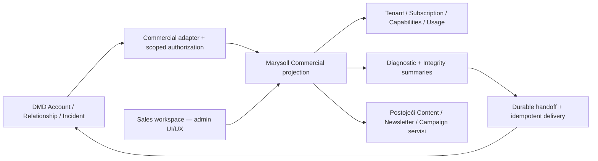

# PANTA — Marysoll Commercial / Client Success

> **Kontrolni dokument — TARGET ugovor, 2026-10-05.**
> Dokumentaciona osnova: `origin/main` na commitu `ebca79e`.
> Grana: `docs/commercial-client-success-contract`.
> Ovaj rez definiše površinu, authority, integraciju i redosled; Commercial
> API, Sales autentifikacija i dashboard još nisu implementirani.
> Status i redosled rada vode se samo u [TODO.md](TODO.md).

> **Authority audit — 2026-10-05:** stvarni kod na svežem `origin/main`
> `fbb57b4`, grana `feat/marysoll-sales-1-commercial-authority`.
> [§17 — izveštaj A–O](#commercial-authority-audit)
> precizira ovaj ugovor za SALES-1 i deli SALES-2 na 2A/2B. Ovo je i dalje
> analysis/documentation only; resolveri, policy, endpointi i Sales auth nisu
> implementirani. Istorijska osnova iznad odnosi se na prvobitni SALES-0 rez.

## 1. Product odluka i persona

Marysoll Commercial / Client Success je Sales representative radni prostor za
Marysoll proizvod: dodeljene naloge, komercijalno stanje, adopciju, marketinšku
asistenciju i support triage. Njegov UI/UX prati admin dashboard, sa svojim
tabovima, stranicama i serverskim ugovorima.

**DMD ostaje glavno radno mesto za odnos sa klijentom i operativni handoff.**
Marysoll je glavno mesto za rad nad činjenicama i dozvoljenim operacijama
Marysoll proizvoda. Ulaz iz DMD Account-a otvara odgovarajući Marysoll
Commercial account view; `Open in DMD` vraća u isti Account ili Incident.

| Površina | Odgovornost |
|---|---|
| DMD Commercial | Relationship, Sales, dodela representative-a, next action, zadaci, ownership support slučaja, Incident i technical handoff |
| Marysoll Commercial | Product truth, komercijalna projekcija, product operations, adopcija, sažeta dijagnostika, priprema kampanja |
| Tenant Admin | Vlasnikov salon i njegovi klijenti, termini, sadržaj, kampanje, loyalty i odobrene tenant operacije |
| Superadmin | Platform administration, tehničke operacije, cross-tenant diagnostics i privilegovane produkcijske radnje |

Commercial je platformska projekcija za treću personu. Ne uvodi novi Salon/Edu
business tenant, ne menja postojeći tenant boundary i ne pravi Sales-a
`OWNER`, `ADMIN`, `STAFF` ili superadminom. Dodela naloga nije članstvo u timu
salona i ne troši salonov staff seat.

## 2. Jedan autoritet po odluci



Commercial je composition surface i projection sloj, ne novi CRM, billing,
Newsletter, Diagnostic niti Marketing engine.

Pojam „Marketing Engine“ iz priloga mapira se na postojeću kanonsku podelu:
Content = sadržaj, Distribution = plasman/atribucija, Notification = transport,
Audience = publika, AI = asistencija. Distribution i novi Growth Studio su
**TARGET**, ne gotovi runtime paketi. Prva Sales projekcija koristi postojeće
Marysoll campaign/newsletter servise kroz njihove authority granice; ne čeka
izdvajanje svih budućih engine-a i ne kopira njihov domen u DMD.

Marysoll ostaje autoritet za tenant, trial/subscription, efektivni plan,
capabilities, product usage, campaign sadržaj/status i diagnostic evidence.
DMD je autoritet za Account, binding/reassignment, commercial assignment,
relationship health, Incident status i assigned technical owner. Cross-link i prikaz sažetka ne
prenose pravo na promenu izvornog zapisa.

## 3. CURRENT — potvrđena polazna osnova

| Postojeće | Izvor i granica za novi rad |
|---|---|
| Tenant i Subscription | [`Tenant.ts`](../src/models/Tenant.ts), [`Subscription.ts`](../src/models/Subscription.ts): odvojeni tenant status, trial polja, billing status, period i provider |
| Efektivni plan | [`planFeatures.ts`](../src/lib/plans/planFeatures.ts), [`effectivePlans.ts`](../src/lib/plans/effectivePlans.ts): status-aware resolver i Tenant fallback; Commercial mora deliti pravila |
| Read sa mogućim write efektom | [`subscriptionService.ts`](../src/lib/plans/subscriptionService.ts) ima `getOrCreateSubscription`; [`features/route.ts`](../src/app/api/subscriptions/features/route.ts) može kreirati legacy Subscription. Commercial GET ne sme koristiti taj efekat |
| Capabilities | [Tenant verticals & capabilities](PANTA-TENANT-VERTICALS-CAPABILITIES.md): platform availability, plan entitlement i tenant enablement; permission i ownership su zasebni uslovi |
| Browser dijagnostika | [`DiagReport.ts`](../src/models/DiagReport.ts): slobodna `label`, UA/IP/host/results i TTL 30 dana; nema authoritative `tenantId`/DMD Account veze |
| Javan report intake | [`public/diag-report/route.ts`](../src/app/api/public/diag-report/route.ts): postoji i bez login-a; label nije identity niti authorization |
| Integrity | [`diagnostic-client.ts`](../src/lib/platform/diagnostic-client.ts) i app kolektori: read-only provere; `failed` znači da provera nije izvršena |
| Newsletter i editor | [`AdminNewsletterDashboard.tsx`](../src/components/admin/AdminNewsletterDashboard.tsx), shared Content Composer, postojeći Marketing AI i campaign API; Sales pristup im još ne postoji |
| Gateway | [Proxy pipeline](PROXY-PIPELINE.md), [`system.ts`](../src/lib/proxy/pipeline/system.ts): `/api/internal/*` prolazi uz interni secret pre daljih guardova; to nije per-Sales account authorization |

U ovom repo-u nije pronađena implementirana Commercial/Sales projekcija ni DMD
adapter. DMD `SALES-0A`, njegova staff identity, assignment i Incident API
poznati su iz priloga kao plan druge platforme; njihove implementacije i
stanje nisu auditovani ovim dokumentom.

## 4. Account ↔ Tenant mapping i pristup

DMD Account nije Marysoll krajnji klijent salona (`TenantUser`), a
`salesRepresentativeId` nije salonov staff ID.

TARGET binding sadrži `bindingId`, `dmdAccountId`, `productKey: marysoll`,
`tenantId`, `environment`, status i revision. DMD poseduje Account, binding/reassignment i dodelu;
Marysoll proverava signed/verified binding, assignment i svoj stvarni tenant. Jedan DMD Account može imati
više proizvoda i više eksplicitno povezanih Marysoll business tenant-a; svaki
prikaz/operacija bira konkretan binding. Za jedan tenant u jednom okruženju
postoji jedan aktivni Marysoll product binding; izuzetak zahteva zaseban ugovor.
Slug, ime, email i slobodna labela služe prikazu, nikad automatskom povezivanju.

DMD subject identitet se mapira na Commercial principal. Marysoll čuva samo
integracionu vezu/policy podatke neophodne za proveru; ne pravi paralelnu
assignment listu koju Sales uređuje lokalno.

```text
allow = verified principal
     && active DMD assignment za konkretan account/binding
     && binding pripada traženom Marysoll tenant-u i okruženju
     && Commercial action permission
     && relevantna tenant capability, za product operaciju
     && konkretan resource pripada tom tenant-u
```

Svaki list/detail/mutation server put primenjuje isti policy. DMD servisna
akreditacija dokazuje ko zove integraciju; uz nju mora postojati proverljiv
actor/assignment context. Sam interni secret, frontend tenant switcher, query
`tenantId`, DMD link ili sakriveno dugme nisu dokaz Sales pristupa.

Scope se ponovo proverava na svakom zahtevu i pre mutacije. Nepoznat,
istakao, opozvan ili neproverljiv assignment zatvara pristup. Cache ne sme
produžavati opozvano ovlašćenje; freshness/revocation ugovor mora biti zatvoren
pre live integracije. Query cache ključ uključuje principal, binding/tenant i
okruženje; promena account-a ne sme prikazati prethodne privatne podatke.

## 5. Sales dashboard — IA i UI/UX ugovor

Predlog route namespace-a je `/commercial`, sa posebnim Commercial shell-om.
Rute u tabeli su **TARGET**, još ne postoje. Produkcijski host bira se u
routing rezu; ovaj dokument ne provisionuje `sales.*` ili drugi domen.

| Tab / stranica | Predlog rute | Sadržaj / dozvoljeni tok |
|---|---|---|
| Overview | `/commercial` | Moji dodeljeni account-i, trial/subscription pažnja, usage/health sažetak i DMD next action |
| Accounts | `/commercial/accounts`, `/commercial/accounts/{bindingId}` | Lista dodeljenih i product dossier pojedinačnog account-a; `Open in DMD` |
| Trials & Subscriptions | `/commercial/subscriptions` | Trial rokovi, billing status i efektivni plan; u početku čitanje |
| Marketing | `/commercial/marketing` | Aktivnost, nacrti, planirane kampanje, performance i neiskorišćene dostupne mogućnosti |
| Newsletter | `/commercial/newsletter` | Drafts, Scheduled, Sent, Performance i Audience summary; kasnije scoped draft akcije |
| Diagnostics | `/commercial/diagnostics` | Sažeti browser reporti i integrity health; dijagnostički link i Incident handoff |
| Incidents | `/commercial/incidents` | DMD status projekcija, technical owner i link; lifecycle se vodi u DMD-u |
| Product Usage | `/commercial/usage` | Booking/staff/adoption i usage/resource agregati sa periodom i svežinom |

Sve account stranice imaju vidljiv izabrani tenant/account i okruženje.
Overview nije platform-wide superadmin statistika: računa samo assigned scope.
Nepovezan account, neuspešno merenje i nula aktivnosti imaju različita stanja.

Izgled koristi postojeći admin dashboard visual language: sidebar, header,
kartice, tabele, filtere, dark mode i responsive ponašanje. Deliti prezentacione
komponente gde su neutralne; ne importovati kompletan admin dashboard/sidebar
sa njegovim data hookovima i zatim skrivati privilegovane tabove.

Commercial navigacija i dostupne akcije dolaze iz server policy projekcije.
Read stranice su Server Components po defaultu; interaktivni leaf-ovi i hookovi
koriste postojeći React Query obrazac. UI ne uvozi Mongo modele ni engine
internals. Sadržajni editor ostaje isti Content Composer uz Commercial host
adapter i svoj endpoint/policy.

Product dossier prikazuje representative-a iz DMD-a; stvarni plan/status,
trial i period iz Marysoll-a; active staff count, booking usage i poslednju
merenu aktivnost; campaign sažetak; otvorene DMD incidente i DMD relationship
health. Primeri poput „Team €49“ iz priloga su ilustracija, ne novi pricing
model: današnji plan ključevi su `maria`, `claudia`, `kiki`, `enterprise`.

## 6. Authoritative trial/subscription projekcija

`MARYSOLL-SALES-1` je preduslov API-ja, jer UI ne sme sam da kombinuje
`Tenant.plan`, trial i Subscription u proizvoljno „Active“ stanje.

Projekcija odvojeno vraća:

- `tenantStatus` i `effectivePlan`, sa izvorom rezolucije;
- `subscriptionStatus`, billing provider i current period end;
- trial status/rok i razlog, iz zajedničkog trial resolvera;
- raspoložive capabilities i vremenski ograničene override-e;
- iznos, valutu i interval samo ako postoji pouzdan billing/catalog izvor,
  jasno označen kao stvarna pretplata ili kataloška cena;
- `asOf` i source/quality state za nepoznato, nedostajuće ili neusaglašeno stanje.

`currentPeriodEnd` nije dokaz „Paid through“. Trialing nije dokaz uplate.
Ne izvodi se iznos iz naziva plana niti iz slike cenovnika. Ako payment
potvrda ne postoji u authority sloju, prikazuje se „Period do…“ ili nepoznato
plaćeno-do, a ne izmišljena potvrda.

Legacy Tenant fallback mora pratiti postojeća efektivna plan pravila; stale
trial boolean ne sme nadjačati istekao rok. Svi granični datumi koriste jedan
server `now`; UI prikazuje datume u odgovarajućoj zoni. Nova read projekcija
ne kreira Subscription, ne produžava trial i ne menja provider stanje.
Sales u prvoj fazi ne može menjati plan, trial, status ni resource kvotu.

## 7. Backend ugovor i DMD adapter pre UI-ja

Predlog versioned transporta, konačan shape zaključava `MARYSOLL-SALES-0/2`:

| Ulaz | Odgovor / namena |
|---|---|
| `GET /api/internal/commercial/v1/accounts` | DMD adapter: paginirane assigned projekcije, bez platform-wide liste |
| `GET /api/internal/commercial/v1/accounts/{dmdAccountId}` | Account sa svojim dozvoljenim product binding-ima; detail bira konkretan binding |
| `GET /api/internal/commercial/v1/bindings/{bindingId}` | Tenant/subscription/trial/capabilities/usage/health projekcija |
| `GET /api/internal/support/v1/bindings/{bindingId}/diagnostics` | Sažeti reporti za dozvoljeni binding |
| `/api/commercial/v1/...` | Browser BFF nad istim projection/policy slojem; Commercial sesija, bez internog secreta u browseru |

Ni jedan od ovih endpoint-a još nije implementiran. Centralizovane Zod šeme
validiraju actor context, query/cursor, body i response; izvedeni tipovi žive u
postojećem `src/types/` obrascu. Namenske server policy/read mapper funkcije
pripremaju allowlist DTO, ne serijalizuju modele pa uklanjaju nekoliko polja.

Read DTO ima verziju, account/binding/tenant identifikatore, product summary,
akcije koje su stvarno dozvoljene i `asOf`/quality za svaki nezavisni izvor.
DMD relationship i Incident podatke drži u svom namespace-u; njihov outage ne
pretvara Marysoll product facts u nule. Neutvrđeno stanje je nullable ili
`unavailable`, a delimično zastareo snapshot je eksplicitno označen.

Nema eksplicitnog ili implicitnog GET side effect-a. Batch list projekcija
koristi shared resolvere i ograničene upite; ne zove deset admin API-ja iz
browsera. DMD dobija sažetke i deep-linkove, bez Marysoll editora i raw baze.

## 8. Diagnostics i Client Health

Sales dobija datum, area, status, razumljiv impact summary, grubo okruženje
(npr. mobile/Safari), report reference i preporučenu sledeću radnju.
Browser report i integrity report su različiti izvori; UI ih ne predstavlja
kao jedno sveže skeniranje ako su prikupljeni u različito vreme.

Client Health za Booking, Loyalty, Vouchers, SEO, Ownership i Push koristi
postojeće dostupne provere i agregate. Ne izmišlja novu proveru samo da popuni
karticu. Rezultat mora razlikovati `ok`, `attention`, `failed`, `not_run`,
`unavailable`/`expired`; `failed` nije zeleno stanje niti 0 findings.
Stari report ne dokazuje današnje stanje. Relationship health i komercijalni
rizik ostaju odvojeni od tehničkog integrity health-a.

Sales ne dobija raw stack trace, evidence dokumente, IP, auth/push tokene,
pune query stringove, privatne klijentske/education/care podatke niti repair
parametre. Summary mapper je allowlist; poruke greške sanitizuje pre prikaza i
pre slanja u DMD. Akcije su `Create Incident`, `Generate Diagnostic Link` i
technical handoff, uz njihov permission. Repair, Delete, Merge i Rebuild
ledger ostaju izvan Commercial policy-ja.

## 9. Diagnostic link i trusted support context

Sales izdaje link za konkretan assigned binding/support case. Primaoc otvara
postojeću dijagnostiku na problematičnom uređaju; login može biti upravo deo
problema, pa samo slanje reporta ne zahteva tenant-admin sesiju.

TARGET `supportToken` je kratkotrajan, potpisan ili opaque server-verifikovan,
sa ograničenom namenom i mogućnošću opoziva. Server vezuje token za
`tenantId`, `dmdAccountId`, representative/principal, support case ili incident
draft reference i okruženje. Rok, bounded submit/reuse politika i token store
zaključavaju se pre izdavanja prvog live linka.

Token daje samo pravo za taj ograničeni diagnostic intake. Ne daje pravo na
čitanje account-a, reporta, klijenata, sesije ili tenant-admin funkcije.
Server iz validnog konteksta određuje association; ne veruje `tenantId`,
account-u ili representative-u poslatom iz browser body-ja. `?u=` može ostati
compatibility label, ali nikada ne povezuje stare reportove automatski sa
Sales account-om. Nepovezani legacy reporti ostaju izvan Sales scope-a.

Token ne sadrži PII i ne ulazi u engine report, analytics, logove niti DMD
source URL. Po prijemu se uklanja iz vidljive adrese gde je moguće; reference
koje se dalje prenose koriste čistu, allowlisted adresu. Postojeći javni report
intake zadržava kompatibilnost, ali dobija Zod whitelist, payload cap i
bounded/rate-limited token intake u odgovarajućem rezu.

## 10. Diagnostics → DMD Incident

DMD Incident je operacionalni artifact nad postojećim product/account-om.
`SalesTicket` je pre-sale informacija od prospect-a i ostaje zaseban domen.
Marysoll ne pravi drugi kanonski Incident lifecycle.

Minimalni handoff sadrži product `marysoll`, account/binding/tenant reference,
source kind/reference, diagnostic report ID, sanitizovan summary, title,
impact, opcionu severity, verified reportedBy i reportedOnBehalfOf,
server timestamp, correlation/idempotency reference i čistu source adresu.
Sales može dopisati kontekst razgovora; to je eksplicitno uneti sadržaj sa
zasebnom validacijom, ne automatsko čitanje poruka ili formulara klijenta.

```text
Client → Sales → Marysoll Diagnostic report (durable)
                     ↓
             Handoff delivery record
                     ↓ retry istog zahteva
              DMD Incident → Technical Owner
                     ↓
      bug/problem → engineering task → commit → QA → release
      configuration/support resolution → verification
      nova potreba → feature/requirement candidate
```

Report se sačuva pre handoff-a i obaveštenja. DMD outage ostavlja report i
minimalan durable delivery zapis za retry, ne lažni „Incident created“.
Retry istog submission ID-ja ne kreira drugi Incident; DMD endpoint mora
podržati idempotency key i vratiti postojeći Incident ID. Novi namerni slučaj
zahteva novi submission ID. Marysoll delivery status nije DMD incident status.

Predloženi DMD status vocabulary iz priloga je:
`new → triaged → needs_information / accepted → investigating → fix_in_progress
→ verification → resolved → closed`. To je vocabulary za budući DMD ugovor,
ne tvrđenje da DMD API već postoji niti da su svi prelazi linearni. DMD
poseduje dozvoljene prelaze i technical assignment. Marysoll prikazuje vraćeno
stanje; ne označava Incident resolved samo zato što je jedan check postao zelen.

Raw `DiagReport` danas ima TTL 30 dana. DMD Incident može zadržati odobren
sanitizovan summary i referencu uz svoju retention politiku; posle TTL-a prikaz
jasno kaže da evidence više nije dostupan. Ne produžavati retention raw
reporta ili kopirati sve payload-e automatski.

[DIAG-SUPPORT-1](PANTA-EDU-CENTAR-ARC.md#posle-pilota--dva-dijagnostička-reza)
već zahteva durable prijavu pre best-effort obaveštenja. Commercial proširuje
isti tok trusted account kontekstom i DMD handoff-om. Pri implementaciji
usklađuju se postojeći lokalni support intake i DMD canonical Incident; ne
nastaju dve nezavisne prijave sa konkurentnim lifecycle-om. Automatsko
kreiranje Incident-a iz critical findings ostaje buduće, posle procene šuma.

## 11. Marketing / Newsletter Sales projection

Sales vidi assigned tenant campaign metadata, Drafts/Scheduled/Sent,
performance, upcoming aktivnosti i audience agregate. Marketing je pogled
na aktivnost/asistenciju, Newsletter na email tok. CURRENT postoje odvojeni
`NewsletterCampaign` i `EmailCampaign` modeli: projekcija nosi
`campaignKind: newsletter | email_ai` i izvorni `campaignId`. Isti zapis u
više tabova zadržava istu referencu; različiti modeli se ne spajaju po naslovu
niti predstavljaju kao jedan ID. Editor se deli gde je sadržajni format isti.

U SALES-5 početno Sales kreira novi Sales draft, uređuje svoj draft samo dok
nije poslat na approval i duplira postojeću kampanju u novi Sales draft.
Ne uređuje tenant-owned/live/sent sadržaj. Request approval zaključava tačnu
revision; kasnija dozvoljena izmena invalidira approval i traži novo odobrenje.
U prvoj verziji odobrava isključivo Tenant OWNER. Send/schedule/publish ostaju
tenant akcije; kasnije je moguća eksplicitna `marketing.approve` ili
managed-service delegacija. Ovo su TARGET pravila, ne implementacija SALES-5. Autorstvo
Sales-a i tenant owner ostaju sačuvani u auditu. Audience izbor koristi
odobrene tenant-scoped segmente, bez pune liste primalaca u Sales response-u.

| Akcija | Početni režim | Kasniji managed-service režim |
|---|---|---|
| Product/account/usage/health read | Assigned scope i read permission | Isti scope |
| Marketing/Newsletter draft write | Tek u SALES-5, uz action permission i tenant capability | Isti uslovi |
| Request tenant approval | Uz immutable revision/reference drafta | Isti uslovi |
| Send / schedule / publish / unpublish | Sales nema pravo; izvršava authorized tenant flow | Eksplicitna aktivna tenant delegacija za konkretnu akciju |
| Audience export/delete i pristup ličnim podacima primalaca | Nedozvoljeno | Nisu deo ovog ugovora |
| Trial/plan/kvota/status promene; integrity repair/merge/delete | Nedozvoljeno | Ostaju izvan Commercial scope-a |

Odobrenje je vezano za tačnu draft revision, content, audience/segment,
channel/action i, za schedule, odobreni termin. Promena bilo čega relevantnog
invalidira odobrenje. Sales ne odobrava sopstveni draft. Tenant approve šalje
ili objavljuje kroz postojeći domenski command uz ponovnu validaciju scope-a,
capability-ja i verzije; Sales ne dobija trajno send pravo od jednokratnog
odobrenja. Stvarna notification/approval UX implementacija pripada SALES-5.

Buduća delegacija, npr. `marketing.publish` ili `newsletter.send`, mora nositi
issuer/authorized tenant actor, tenant, delegate, precizan action/resource
scope, rok, opoziv i audit. Nazivi su **TARGET**, nisu postojeći capability
ključevi. Assignment, tenant feature entitlement i delegation su različite
odluke. Zakazivanje je send autoritet: backend scheduler ne sme izvršiti
neodobren Sales draft niti zaobići opoziv delegacije po definisanom ugovoru.
Managed-service write se ne otvara u read-only foundation-u.

## 12. Proxy, autentifikacija i cross-linkovi

Commercial page/API namespace mora biti eksplicitno zaštićen pre dodavanja
UI-ja. Novi `commercial` segment ulazi u centralni reserved system vocabulary
pre path-based tenant detekcije. Postojeći admin/superadmin role guardovi se
ne proširuju tako da Sales nasledi njihove privilegije.

Gateway ostaje orchestration preko platformskih klijenata. Commercial
identity/assignment policy živi u svom server adapteru i route/service sloju;
proxy ne uvozi campaign modele niti odlučuje billing pravila. Interni early
pass zahteva novu route-level account/actor proveru i kada je secret validan.
Browser nikada ne dobija `INTERNAL_API_SECRET` niti DMD servisnu akreditaciju.

DMD → Marysoll link sadrži binding/resource adresu, ne bearer sesiju ili
privilegovani `supportToken`. Prijava/SSO exchange je zaseban ugovor sa DMD
`SALES-0A`: verified issuer/audience, kratko trajanje, replay/state zaštita,
proverljiv principal i aktuelna assignment. Link sam ne loguje korisnika.
Marysoll → DMD URL gradi server iz allowlisted environment config-a; arbitrary
return URL iz browsera ne postaje redirect. Svaka aplikacija proverava svoj
pristup i na direktno otvorenom deep-linku.

Produkcija je host-based; staging/QA/localhost/preview su path-based po
postojećem host-context ugovoru. Cross-linkovi i callback-i ostaju u svom
okruženju. Routing matrica mora pokriti oba smera, tenant wildcard/custom
domene, reserved segment, direktan API, expired session i cross-tenant pokušaj.

## 13. Rezovi i redosled implementacije

Dosledan prefiks je **MARYSOLL-SALES** (normalizacija `MARYSOL-SALES` iz priloga).
Ova tabela definiše acceptance ugovore, ne označava implementaciju završenom.

| Rez | Isporuka i acceptance gate | Zavisnost |
|---|---|---|
| SALES-0 — Commercial Projection Contract | Ovaj kontrolni dokument; dogovor DMD actor/assignment/binding i versioned DTO, permission matrica, scope/no-write/privacy pravila | Dokument je napisan; cross-platform auth/API detalji čekaju DMD potvrdu |
| SALES-1 — Trial/subscription authority | Shared read-only resolver; legacy fallback, rokovi, missing Subscription, source/unknown, stvarna cena bez pretpostavki; dokaz GET nema write | SALES-0; ne zahteva DMD staff auth za unit/integration testove |
| SALES-2A — Commercial projection/policy/DTO | Read service + scoped policy + versioned schema; fixture principali i DMD adapter contract, assigned list/detail, pagination, isolation testovi | SALES-1 zatvoren resolverima i testovima; bez HTTP ruta |
| SALES-2B — Internal read-only endpoints | Tanak HTTP transport nad SALES-2A; adapter fixtures/integration; validacija actor assertion-a, proxy gate i no-write dokaz | SALES-2A zatvoren; live pristup tek uz verified DMD identity/assignment |
| SALES-3 — Diagnostic/support projection | Sanitizovani browser/integrity DTO; report↔tenant binding; restricted support token intake, revocation/expiry i legacy compatibility | SALES-2 policy; koristi postojeći Diagnostic sloj |
| SALES-4 — DMD Incident handoff | Durable report/delivery, idempotent adapter i Incident reference/status projection; timeout/retry/duplicate test | SALES-3 + DMD Incident contract/API |
| SALES-5 — Marketing/Newsletter projection | Read summaries + scoped draft/duplicate/request approval; revision-bound tenant approval; postojeći editor/commands, bez Sales send defaulta | SALES-2; tenant approval i audit pre prvog write-a |
| SALES-6 — Commercial dashboard | Admin visual shell, osam tabova/stranica, assigned tenant context, oba cross-linka, UI states i responsive acceptance | SALES-2 + dokazan DMD adapter; Diagnostics/Incidents/write moduli tek kad SALES-3/4/5 gate-ovi prođu |

Prvo backend contract i DMD adapter, potom UI. Read UI iz SALES-6 može pokazati
samo završene module; ostali se jasno označavaju unavailable/planned i nemaju
aktivne write akcije. DMD `SALES-0A` i Marysoll resolver/DTO/sanitization rad mogu
napredovati paralelno uz test principale i adapter fixtures, bez puštanja
neautorizovanog produkcijskog endpoint-a i bez privremenog superadmin login-a.

Postojeći STAFF-3 acceptance, Education pilot i odloženi T3/Distribution dugovi
ostaju u tracker-u. Ovaj dokument otvara Commercial luk; nije nalog da se
implementiraju svi rezovi ili da se usput preprave ostali domeni.

## 14. Release i verifikacioni gate

Task grane uvek kreću od svežeg **`origin/main`**. Engine/projection kandidati
idu kroz `staging/production-engines`; proxy/auth regression kroz
`staging/production-fixes` prema [branching strategiji](PANTA-BRANCHING-STRATEGY.md).
Shared-DB pravila ostaju: additive/optional promene, legacy runtime default,
bez globalnog backfill-a; tenant-scoped dry-run pre eksplicitnog apply-a.
Staging domen nije dokaz izolovane baze; aktivni DB target proverava se pre
write QA, migracija ili slanja. DMD i Marysoll test identiteti ne smeju prelaziti
iz staging-a u produkciju preko cross-linka ili integracije.

Implementacioni release mora dokazati:

1. Nema tokena, assignment-a ili dozvole: direktan page/API pristup odbijen;
   assigned A ne može listati, otvoriti, draftovati ili dijagnostikovati B.
2. Opozvan assignment/delegation i pogrešno okruženje zatvaraju pristup; DMD
   outage i stale policy ne proširuju scope.
3. Commercial GET ne menja Tenant, Subscription, campaigns niti integrity
   podatke; source/failed/unknown se ne pretvaraju u zdravo ili nulu.
4. Token tamper/expiry/replay ne povezuje report sa tuđim tenantom; nijedna
   Sales projekcija, SSR/RSC payload ili handoff ne izlaže privatni evidence.
5. Report ostaje posle neuspelog DMD slanja; retry daje jedan Incident ID.
6. Sales draft ne može send/schedule/publish kroz direktan API, scheduler ili
   izmenu live sadržaja; tenant approval revizija se proverava server-side.
7. Proxy matrica, source typecheck, propisani code-quality/build i app/engine
   testovi prolaze; live QA na stabilnom domenu i browser acceptance sa Sales,
   tenant owner i technical owner principalima prethode produkciji.

Rizični multi-model workflow, npr. buduće binding reassignment ili delegacija
sa više domain write efekata, dobija matching read-only integrity proveru u
istom PR-u, prema Architectural Rules. Ovaj doc-only rez ne izvršava migracije,
DMD zahteve, deploy niti izmene runtime-a.

## 15. Otvorene odluke pre live povezivanja

| Odluka | Vlasnik / granica |
|---|---|
| DMD principal/SSO/service credential, assignment revocation i mapping API | Zajednički DMD SALES-0A + Marysoll SALES-0/2; u ovom repo-u nije potvrđeno |
| Konačni production host i auth/session cookie scope za Commercial | Marysoll proxy/identity rez; staging ostaje path-based |
| Binding lifecycle i audit reassignment-a | Product Owner zaključano: DMD `account.binding.manage`, interni operator → kasnije commercial_admin; Sales nema self-assign; Marysoll verifier/read mirror |
| Trial/billing read precedence i price/paid-through | Zaključano auditom u §17 C–E; source-aware read, payment/price unavailable. Novi billing evidence izvor je zaseban budući scope |
| Support token rok/bounded reuse, sanitized summary retention i evidence expiry UX | SALES-3/4 + DMD Incident policy |
| Sales draft ownership i approval | Product Owner zaključano: novi/sopstveni pre-approval Sales draft, duplicate u novi; Tenant OWNER odobrava revision; tenant-owned/live/sent sadržaj se ne menja |
| Kasnija managed-service delegacija i efekat opoziva na odobrene schedule-e | Poseban write/delegation rez posle read/draft acceptance-a |

## 16. Kanonske reference

- [Architectural Rules](ARCHITECTURAL_RULES.md)
- [Product Engines](ARHITEKTURA-ENGINES.md)
- [Branching i QA](PANTA-BRANCHING-STRATEGY.md)
- [Proxy pipeline](PROXY-PIPELINE.md)
- [Tenant verticals i capabilities](PANTA-TENANT-VERTICALS-CAPABILITIES.md)
- [Ownership i Team lifecycle](PANTA-TENANT-OWNERSHIP-LIFECYCLE.md)
- [Diagnostic / Integrity](PANTA-IDENTITY-LOYALTY-HEALTH.md)
- [Newsletter / Blog authoring](PANTA-NEWSLETTER-BLOG-AUTHORING.md)
- [Content Composer](PANTA-CONTENT-COMPOSER-UX.md)
- [Distribution Engine](PANTA-DISTRIBUTION-ENGINE.md)
- [Growth Studio](PANTA-GROWTH-STUDIO.md)
- [Payments granica](PANTA-PAYMENTS-ENGINE.md)
- [Superadmin statistika / usage](SUPERADMIN-STATISTIKA-I-RESOURCE-QUOTA.md)
- [Operativni tracker](TODO.md)


<a id="commercial-authority-audit"></a>

## 17. Authority audit — canonical decision closure (A–O)

**Presek:** `fbb57b4`, 2026-10-05. Ovo je statički audit Marysoll izvora i
ciljana provera postojećih testova. Nisu čitani produkcijski zapisi, Paddle API
niti DMD repozitorijum. `CURRENT` ispod znači ponašanje koda; `DECISION` je
ugovor naredne implementacije, ne tvrdnja da je već u runtime-u. §17 precizira
prethodne opšte authority redove; ne menja SALES-0 product odluku.

### A. Trial state inventory

Inventar je dobijen pretragom `trialEndsAt`, `isTrialActive`, `trialing` i
provider trial naziva kroz `src/`, `packages/` i `scripts/`, uz praćenje
plan/capability pozivalaca. Nema zasebnog Subscription `trialEndsAt`,
`trialStartedAt`, trial revision-a niti provider-verified trial snapshot-a.

| Izvor / potrošač | CURRENT ponašanje i posledica |
|---|---|
| [Tenant](../src/models/Tenant.ts) | `isTrialActive`, `trialEndsAt`, `trialMode`, `trialRequiredCard`; null/false schema default nije dokaz da legacy trial nikad nije postojao. `trialMode=free` se normalizuje tek pri validate/save, ne pri lean read-u |
| [Subscription](../src/models/Subscription.ts) | `status=trialing` + generički `currentPeriodStart/End`; schema default period je 14 dana. Nema namenskog trial datuma ni dokaza nastanka polja |
| [Registration](../src/app/api/tenants/register/route.ts) | Kreira pending Tenant sa false/null trial-om, ali odmah kreira Maria trialing Subscription i budući period. To nije dokaz da je probni period zaista počeo |
| [Verify GET/POST](../src/app/api/auth/verify/route.ts) | Aktivira Tenant trial i menja Subscription period pri owner verifikaciji. GET ponovo čita env trial dane/auto-approve; POST koristi env-backed module konstantu `TRIAL_DAYS` i aktivira bez auto-approve opcije |
| [Superadmin trial](../src/app/api/superadmin/tenants/[tenantId]/trial/route.ts) | Activate/extend/deactivate menjaju samo Tenant trial; extend zato može ostaviti star Subscription period. Komentar pominje `set_trial_type`, ali switch ga ne implementira |
| [Superadmin status](../src/app/api/superadmin/tenants/[tenantId]/status/route.ts) / [plan](../src/app/api/superadmin/tenants/[tenantId]/plan/route.ts) | Status suspended/cancelled gasi Tenant flag. Plan dodela sinhronizuje Subscription kao internal active, ali ne čisti stare Tenant trial datume/flag |
| [Paddle handler](../src/lib/paddle.ts) | Subscription status/period vodi billing. Tenant flag prati trialing, ali `trialEndsAt` se ne ažurira; stari registracioni datum može ostati tokom provider trial-a. Nedostajući provider period sintetizuje se kao sada +30 dana |
| [Effective plan](../src/lib/plans/planFeatures.ts), [batch](../src/lib/plans/effectivePlans.ts), [feature read](../src/lib/plans/planEnforcement.ts), [capability read](../src/lib/platform/capabilities-server.ts) | Koriste Subscription status, internal period i Tenant paid/plan expiry fallback. Registracioni Maria trial ne daje plaćeni plan; važe zasebni vremenski feature override-i |
| [subscriptionService](../src/lib/plans/subscriptionService.ts) / [features GET](../src/app/api/subscriptions/features/route.ts) | Legacy get-or-create: flag → trialing, paid → active, inače expired; period iz planExpiresAt ili +30 dana. Čitanje može upisati novi Subscription, bez provere trial roka |
| [Booking helper](../src/lib/appointments/booking.ts) / [booking API](../src/app/api/booking/route.ts) | Flag + rok > lokalni now; paid ili Maria imaju zaseban prolaz. [Appointment update](../src/app/api/appointments/update/[id]/route.ts) proverava verified + paid/flag bez trial datuma |
| [Plan status API](../src/app/api/tenants/plan-status/route.ts) / [tenant me](../src/app/api/tenants/me/route.ts) | Vraćaju sirovi Tenant flag/datum, bez kanonske trial odluke. Plan-status efektivni plan ipak dobija iz shared feature resolvera |
| [Superadmin tenants](../src/app/api/superadmin/tenants/route.ts) / [stats](../src/app/api/superadmin/stats/route.ts) | Lista vraća flag i nezavisno clamped daysLeft; stats traži flag + budući datum. `trialConversionRate` je paidTenants/totalTenants, ne cohort trial conversion |
| [PlanStatusBanner](../src/components/admin/plan/PlanStatusBanner.tsx), [PlanInfoCard](../src/components/admin/plan/PlanInfoCard.tsx), [AdminPlanStatus](../src/components/admin/plan/AdminPlanStatus.tsx) | Banner koristi browser Date.now; kartica bira datum i trial badge po flag-u. Nisu Commercial authority |
| [SuperAdminDashboardClient](../src/components/superadmin/SuperAdminDashboardClient.tsx) / [SaloniTab](../src/components/superadmin/tabs/SaloniTab.tsx) | Trial tab filtrira aktuelne samo po flag-u, expired po ugašenom flag-u + datumu; Kiki/Enterprise trial koristi feature override, ne novi trial billing plan |
| [useTenantAdmin](../src/hooks/useTenantAdmin.ts), [usePlanStatus](../src/hooks/usePlanStatus.ts), [usePlanFeatures](../src/hooks/usePlanFeatures.ts), [superadmin tenant types](../src/types/superadmin-tenants.ts), [plan-status types](../src/types/plan-status.ts) | Prenos postojećih admin DTO-a; usePlanFeatures vraća Maria fallback pri odsutnom odgovoru. Taj UI fallback nije dokaz successful read-a |
| [Onboarding](../src/lib/email/onboarding.ts) / [welcome template](../src/lib/email/templates/otherTemplates.ts) / platform settings | Konfiguracija i email prikaz trajanja, ne autoritet tekućeg trial-a; email navodi konstantni `TRIAL_DAYS` i prosleđeni datum |
| [Tenant deletion](../src/lib/tenant/deleteTenant.ts) i njegov contract test | Trialing je jedan od Paddle statusa koji mogu kasnije naplatiti; brisanje zato ima write/cancel gate. Ne koristiti kao read resolver |

[Plan.trialDays](../src/models/Plan.ts), `PLAN_FEATURES.maria.trialDays=14`,
`TRIAL_DAYS` (env, fallback 30) i platform-settings vrednosti su defaults/config,
ne preostali dani konkretnog tenant-a. [Platform settings ruta](../src/app/api/superadmin/platform-settings/route.ts)
čuva postavke u in-memory promenljivoj; registration/verify čitaju env.
[IServiceSubscription](../src/types/index.ts) i `useAdminServices` trialing
default pripadaju paketu tretmana salona, **ne** tenant pretplati. Postojeći
plan-status, capability i deleteTenant testovi sadrže fixture/contract trial
vrednosti; ne uvode dodatni runtime izvor. Komercijalni audit ih ne spaja.

### B. Subscription / billing authority inventory

| Odluka | Autoritet koji danas zaista postoji |
|---|---|
| Tenant lifecycle | Tenant.status; billing active ne menja prikaz suspendovanog tenant-a u active |
| Entitlement plan | `resolveEffectivePlan`: prvo non-Maria Subscription active/trialing/past_due; internal dodatno period > now ili nedostajući period; Paddle rok vodi webhook status. Zatim Tenant.paid + non-Maria plan + važeći/odsutan planExpiresAt; zatim Maria |
| Billing status/provider | Subscription.status/billingProvider. Tenant.paid je kompatibilni access flag: Paddle ga postavlja i za trialing/past_due, superadmin i za besplatnu ručnu dodelu |
| Period | Subscription.currentPeriodEnd je sačuvani period, može biti model/helper/provider fallback. Tenant.planExpiresAt je rok legacy dodele; nikad ga pretvarati u provider billing period |
| Features / capabilities | `PLAN_FEATURES`, `resolveActiveFeatureOverrides`, `getPlanFeatures` i `resolveCapability`; Plan.features iz Mongo kataloga nije entitlement authority |
| Pricing catalog | Plan.priceMonthly/Yearly i Paddle price ID-evi. Model nema currency ni tenant-specific iznos/popust/tax/quantity snapshot; katalog se menja i nije invoice |
| Checkout | [Paddle checkout](../src/app/api/paddle/checkout/route.ts) trenutno bira monthly price ID; [createPaddleTransaction](../src/lib/paddle.ts) kreira provider transakciju/customer-a, nije read funkcija niti dokaz uplate |
| Payment evidence | [WebhookEvent](../src/models/WebhookEvent.ts) čuva potpisano primljene raw događaje. Non-subscription događaji se čuvaju kao skipped, bez kanonske tenant/subscription/payment-period projekcije; Subscription.paddleTransactionId se ne popunjava u postojećem sync-u |

**DECISION:** ne uvoditi billing politiku u Commercial. `past_due` i dalje
koristi postojeći grace; provider trial kojem je sačuvani rok prošao može biti
`trial=expired`, dok status-aware efektivni plan ostaje isti kao u runtime-u.
To neslaganje se prikazuje, ne popravlja write-om niti novim access pravilom.
Internal vs Paddle se nikad ne zaključuje iz zaostalih Paddle ID-jeva kada
postoji eksplicitni billingProvider; ručna plan dodela može ostaviti te ID-jeve.

### C. Kanonski `resolveCommercialTrialState` ugovor

**DECISION za SALES-1:** jedna čista funkcija
`resolveCommercialTrialState({ tenant, subscription, now })`. Obavezni `now`
je validan server Date, prosleđen svim resolverima istog odgovora/batch-a.
Bez DB, model hydration-a, Date.now, provider fetch-a i mutiranja ulaza.
`subscription=null` znači uspešan lookup bez zapisa; query failure nije null.

Rezultat ima `status: active | expired | inactive | not_started | not_trialing
| unknown`, `endsAt: ISO | null`, `source: tenant_trial | subscription_period
| subscription_status | none`, machine-readable `reason`,
`quality: authoritative | legacy | partial | unavailable` i `issues[]`.
Issues sadrže kod, izvore i uporedive validne datume/status/flag; bez raw modela,
PII, slobodnih override beleški i izmišljene istorije. `expired` znači da je
odabrani sačuvani trial rok <= now; ne tvrdi billing cancellation.

Redosled je sledeći; ne uzimati min/max dva datuma kao univerzalnu politiku:

1. Invalid/unrecognized Subscription status/provider zatvara billing trial
   interpretaciju u unknown/partial; ne predstavlja se kao missing Subscription.
2. Validna Subscription sa non-trialing statusom određuje `not_trialing`.
   Stari Tenant trial signal ostaje issue `tenant_trial_with_non_trialing_subscription`.
   Ne tvrditi converted/paid: internal active može biti ručna dodela, a false
   flag ne dokazuje da je neko platio. Potencijalna ručna trial akcija posle
   dodele nema revision/provenance da bi nadjačala billing status; prikazati issue.
3. Paddle trialing koristi sačuvani Subscription.currentPeriodEnd. Budući rok
   je active, rok <= now expired; Tenant flag/datum ne nadjačavaju provider
   projekciju. Validan datum ovde ima partial provenance: trenutni handler
   može ga sintetizovati, pa source nije `verified_paddle_trial_end`.
4. Internal trialing ili uspešno nedostajući Subscription koriste Tenant
   trial lifecycle. Validan Tenant trial datum je autoritet i pri drugačijem
   Subscription periodu, jer superadmin extend menja samo Tenant.
   Nedostajući billingProvider na validnom legacy zapisu prati postojeći
   internal default **uz issue**; ne izmišljati potvrđeni provider.
5. Flag true zahteva validan datum: > now active, <= now expired. Flag false
   i prošli datum daju expired (razlog ugašen/istekao sačuvani trial); false
   i budući datum inactive. False/null na pending neaktiviranom tenant-u daje
   not_started, iako je registration već napravio trialing Subscription.
   Na tenant-u koji nije pending, uz internal trialing Subscription, false/null daje
   unknown: billing tvrdi trial, a Tenant ne potvrđuje aktivaciju. Kada
   Subscription nedostaje, eksplicitni false/null daje not_trialing; bez oba
   trial polja daje unknown. Flag true ili odsutan flag uz
   nedostajući/invalid datum ne daje active. Odsutan flag uz
   važeći datum daje unknown: datum sam ne dokazuje aktivaciju/opoziv.
6. Nepotpuni/invalid podaci ostaju označeni; nema +14/+30 fallback-a. Tenant
   status se vraća odvojeno, trial projection ne aktivira pending/suspended tenant.

| Konkretan slučaj | Result / source / reason / quality |
|---|---|
| Internal trialing + Tenant flag true, Tenant rok prošao, Subscription rok budući | expired / tenant_trial / `tenant_trial_elapsed` / partial + `trial_dates_disagree`; ne verovati stale flag-u |
| Internal trialing + Tenant rok budući, Subscription rok prošao | active / tenant_trial / `tenant_trial_running` / partial + `trial_dates_disagree`; evidentira manual-extend obrazac bez repair-a |
| Paddle trialing + Tenant trial prošao, Subscription rok budući | active / subscription_period / `paddle_trial_period_running` / partial + disagreement; lokalni registracioni datum je sekundaran |
| Paddle trialing + Subscription rok <= now | expired / subscription_period / `paddle_trial_period_elapsed` / partial + `subscription_still_trialing`; effective plan se ne menja ovom odlukom |
| Tenant flag true + budući datum, Subscription missing | active / tenant_trial / `legacy_tenant_trial_running` / legacy |
| Tenant flag true + prošli datum, Subscription missing | expired / tenant_trial / `legacy_tenant_trial_elapsed` / legacy + stale flag issue |
| Subscription active/past_due/cancelled/paused/expired + zaostali Tenant trial | not_trialing / subscription_status / `subscription_not_trialing` / partial + issue; stvarni subscriptionStatus ostaje zasebno vidljiv |
| Pending Tenant false/null + registracioni internal trialing Subscription | not_started / tenant_trial / `tenant_trial_not_started` / authoritative; provisional Subscription period nije početak trial-a |
| Internal trialing + Tenant false i budući datum | inactive / tenant_trial / `tenant_trial_disabled` / partial + disagreement sa statusom |
| Internal trialing + Tenant koji nije pending, false/null | unknown / none / `internal_trial_activation_unconfirmed` / partial; ne koristiti generički period kao dokaz start-a |
| Flag true bez validnog datuma; Paddle trialing bez validnog perioda | unknown / odgovarajući izvor / `trial_end_missing` ili `trial_end_invalid` / partial |
| Subscription missing, oba Tenant trial polja missing | unknown / none / `trial_evidence_missing` / unavailable; legacy nije implicitni trial |
| Subscription missing, eksplicitni Tenant false/null, tenant nije pending | not_trialing / tenant_trial / `tenant_trial_not_active` / legacy; ne tvrdi da nikada nije bilo trial-a |
| Nepoznat Subscription status/provider, invalid dates/boolean | unknown za pogođenu odluku / none ili validan identifikovan izvor / `trial_evidence_invalid` / partial; ne coercirati truthy string u active |

Za datume granica je strogo `end > now`; jednako now je expired. Različiti
validni datumi su issue i kada daju isti status. Quality authoritative znači
najbolji lokalni lifecycle podatak, ne potvrđenu realtime provider istinu.
Nedostajući Subscription daje legacy; konflikt/nepotpunost ima prednost i
daje partial. Nijedan od ovih read ishoda ne menja booking, login ili postojeći
feature gate u SALES-1: migracija njihovih trial potrošača je zaseban rez.

Stale flag true uz prošli datum je vremenski signal koji resolver ispravno
zatvara u expired, ne dokaz korumpiranog zapisa: sam taj informational issue
ne obara legacy kvalitet. Različiti authority datumi/statusi ili invalid/missing
polje potrebno za odluku jesu partial. Internal trialing bez validnih Tenant
trial polja nikad ne koristi Subscription model default period kao zamenu.

### D. Commercial subscription projection ugovor

**DECISION:** `resolveCommercialSubscriptionState({ tenant, subscription, now })`
je jedina Commercial domen/read funkcija. Poziva trial resolver, zajedničku
effective-plan odluku, aktivne override-e i čisti capability resolver nad
istim već učitanim snapshot-om. HTTP handler/UI ne sastavljaju ove odluke.

TARGET shape, centralizovan Zod contract u `src/types/commercial-subscription.ts`:

```text
schemaVersion: 1
asOf: ISO server now
tenantId: valid Marysoll Tenant._id
tenantStatus: active | suspended | pending | cancelled | null
effectivePlan: maria | claudia | kiki | enterprise
effectivePlanSource: subscription | tenant_legacy | maria_default
subscriptionStatus: trialing | active | past_due | cancelled | paused | expired | null
billingProvider: internal | paddle | null
trial: rezultat iz C
currentPeriodEnd: ISO | null
paidThrough: { value: null, source: unavailable, reason: payment_evidence_unavailable }
price: { amount: null, currency: null, interval: null,
         source: unavailable, reason: subscription_price_snapshot_missing }
features: validirana PLAN_FEATURES + aktivni override-i
capabilities: { verticals, capabilities: ResolvedCapability po poznatom ključu }
fieldSources: source + quality + reason za nezavisne odluke/polja
quality: { state: authoritative | legacy | partial | unavailable, issues: [...] }
```

`fieldSources` pokriva tenantStatus, effectivePlan, subscriptionStatus,
billingProvider, trial, currentPeriodEnd, paidThrough, price, features i
capabilities. `Subscription.updatedAt` i `Tenant.updatedAt` mogu biti source
snapshot timestamps; nisu provider occurredAt niti datum poslednje aktivnosti
klijenta. `asOf` označava vreme rezolucije, ne garantovanu svežinu webhook-a.

Missing Subscription → `subscriptionStatus=null`, `billingProvider=null`,
`currentPeriodEnd=null`; nema sintetičkog active/expired dokumenta. Efektivni
plan i trial ipak mogu doći iz legacy Tenant-a. Missing provider na postojećem
legacy Subscription-u ostaje null u DTO-u; shared plan semantika internal
fallback-a se označava provenance-om. Missing Tenant je typed not-found,
ne uspešna Maria projekcija. Lookup greška daje typed read-failure; core
billing query greška se nikad ne predstavlja kao missing/legacy success.

Za effectivePlan provenance proširiti postojeće jedno pravilo na detaljnu
odluku, a `resolveEffectivePlan` ostaviti kao kompatibilan wrapper koji vraća
plan. **Ne pisati paralelan isti if/else u Commercial-u.** Zadržati sve važeće
subscription/internal-expiry/Paddle/grace/Tenant-fallback grane, uključujući
fallback sa važećeg Tenant-a kada Subscription ne daje plan. Tenant paid nije
payment source. Schema validacija/normalizacija pre resolvera čuva missing
naspram invalid polja; invalid plan/status/provider/date ne sme postati novi
paid-plan grant. Problematični izvor izostaviti iz entitlement input-a, uz
partial issue i konzervativni fallback iz preostalih validnih podataka.

Features/capabilities se računaju sa istim now i istom odlukom o planu.
Vraćaju odvojeno platformAvailable, planEntitled, tenantEnabled i enabled;
to **nije** Sales action permission. `distribution.campaigns` trenutno ima
platformAvailable=false i unmapped plan: read pokazuje to stanje, ne uključuje
ga radi postojeće Newsletter funkcionalnosti. Legacy newsletter/AI feature
ključevi su odvojen current gate do SALES-5 mapiranja. Resursne kvote nisu
`dbStorageGb`; resource projekcija kasnije koristi postojeći soft quota ugovor.

Aggregate quality: invalid/conflicting/nepotpun obavezni source → partial;
čist uspešan Tenant fallback bez Subscription → legacy; potpuni usklađeni
lokalni sources → authoritative. Potpuni neuspeh resolver input-a/read-a je
unavailable/failure, ne healthy. Predviđeno odsustvo opcionalnog payment/price
izvora ostaje field-level unavailable i samo po sebi ne pretvara svaki inače
valjan account u grešku. DMD/Marketing/diagnostic podaci nisu SALES-1 input-i.

### E. Polja koja trenutno nije moguće istinito obezbediti

| Polje | SALES-1 odluka |
|---|---|
| Stvarni paidThrough | null/unavailable. Subscription status, period i Tenant.paid ne dokazuju uplatu; raw WebhookEvent nije obrađena payment-period evidencija |
| Stvarni subscription amount/currency/interval | null/unavailable. Plan katalog nema currency ni invoice detalje; price ID/monthly checkout nisu sačuvani billed snapshot |
| Provider-verified trial start/end i trenutna svežina billing-a | Nema dedicated provider trial fields/verifiedAt. Sačuvani period se može prikazati uz partial provenance; updatedAt nije provider verification |
| Confirmed conversion ili istorija restart/opoziva trial-a | Nema lifecycle event/revision istorije; ne zaključivati konverziju iz active/paid ni uzrok deactivation-a samo iz false flag-a |
| DMD assignment/relationship/Incident facts | Nema lokalnog DMD adaptera/binding-a; unavailable dok adapter ne dobije proverljiv source. Nisu blocker SALES-1 |

Kataloška ponuda može kasnije imati zaseban catalogPrice DTO sa eksplicitnom
valutom/izvorom i nazivom „kataloška cena“. Ne popunjavati stvarni price iz
Plan.priceMonthly ni za Maria sa pretpostavljenim amount=0/currency=EUR.

### F. DMD Account ↔ Marysoll Tenant binding odluka

[AuthUser](../src/models/AuthUser.ts) je login identitet; [TenantUser](../src/models/TenantUser.ts)
je tenant članstvo/klijent; Tenant.ownerId nije DMD Account. Security key je
Tenant._id, nikad mutable slug. Jedan owner može predstavljati više business
workspace-a; binding zato povezuje konkretan tenant, ne sve owner naloge.

**DECISION:** Marysoll-verifikovan `ProductAccountBinding` read boundary:
`bindingId` (immutable opaque), `dmdAccountId` (opaque DMD key),
`productKey=marysoll`, `tenantId` (ObjectId string), `environment`,
`status: pending | active | suspended | revoked`, monotonic `revision`,
`createdAt`, `updatedAt`, `verifiedAt`, `verifiedBy` reference; revokedAt i
reason code kada je opozvan. Sales DTO ne mora izlagati audit actor detalje.

Pending → active samo posle eksplicitne provere stvarnog tenant-a i oba
sistema; active ↔ suspended uz revision i audit; revoked je terminalan.
Rebinding menja vezu novim bindingId/revision ugovorom, ne prepisuje aktivni
account/tenant par u mestu. Najviše jedan aktivni Marysoll product binding po
tenant-u i okruženju; Account može imati više binding-a. Missing/deleted tenant,
unknown env, neaktivan binding ili revision mismatch zatvaraju scope.
Binding lifecycle nije subscription lifecycle: suspendovan tenant sme imati
assigned Commercial status read za support, ali to ne daje product write.

**Product Owner zaključano, 2026-10-05:** DMD poseduje Account, binding/
reassignment i Sales assignment. TARGET `account.binding.manage` inicijalno
ima samo privilegovani interni operator; kasnije može `commercial_admin`.
`staff_sales` nikada ne dodeljuje account/tenant sebi. Svaka promena ima DMD
audit i novu revision; Marysoll čita/verifikuje signed/verified binding i
assignment, a eventualni lokalni snapshot je read mirror, ne writer authority.
Read-only Client Success pristup ne traži zasebno Tenant OWNER odobrenje;
buduće delegated write akcije zahtevaju tenant authorization. Nema Marysoll
assignment editor-a niti povezivanja preko email/name/slug/label.
SALES-2A koristi typed repository port sa fixture binding-ima; ne zahteva DB
migraciju ni auth. DMD binding capability/provisioning i signed assertion
transport moraju biti tehnički rešeni pre live SALES-2B, van read handlera.
Authority odluka je zatvorena; wire encoding nije product odluka.

### G. DMD actor / assignment assertions koje Marysoll mora verifikovati

Transport mora razlikovati service caller i stvarnog Sales actor-a. TARGET
verified principal/context, nezavisan od Marysoll `DecodedToken` admin role:

- trusted `issuer`, `audience=marysoll-commercial`, `subject`/dmdStaffId,
  identitet/namena servisnog caller-a i eksplicitni acting-for subject;
- environment, issuedAt, notBefore, expiresAt, assertion ID/replay zaštita i
  schema/contract version; potpisi/akreditacija iz allowlisted issuer-a;
- aktivan actor i aktuelan assignmentId/revision/status za konkretan
  dmdAccountId; proverljiv checkedAt/revocation podatak na svakom request-u;
- Marysoll actions koje taj actor traži/sme po integracionom ugovoru;
  action vocabulary je lokalni policy allowlist, ne proizvoljan DMD role string;
- bindingId/revision i resource context provereni u Marysoll-u; caller-ov
  tenantId se samo poredi sa resolverom, nikada ne bira drugi tenant.

Za list read važi verifikovan paginiran skup assigned Account-a; ne globalna
lista pa frontend filter. Cursor mora ostati u istom principal/scope/env i
current assignment-u; promena revision-a invalidira nastavak. Između scoping-a
i response-a promenjen binding/assignment mora odbiti/revalidirati odgovor.
`x-internal-secret` je transport gate, nije assignment assertion. DMD outage,
nepoznata revocation freshness ili istek zatvaraju protected pristup; cache
ne odobrava offline Sales access. SALES-2A test principale pravi isključivo
fixture adapter, nikakav produkcijski fallback iz headera/tenant admin JWT-a.

Crypto format, SSO exchange i aktuelni DMD assignment API zahtevaju zajednički
tehnički ugovor pre live endpoint-a. Ne blokiraju implementaciju pure resolvera,
policy-ja i DTO-a; nije potrebno izmišljati SALES platformRole u AuthUser-u.

### H. Diagnostics compatibility nalazi

[runIntegrityChecks](../src/lib/diagnostics/integrity/runner.ts) i
[loaders](../src/lib/diagnostics/integrity/loaders.ts) imaju DB read-only
ponašanje i tenant filtere, ali **nemaju actor/assignment authorization**.
Mogu se koristiti kasnije iza Sales scope provere i dedicated sanitizacije;
on-demand scan je posebno ograničena skuplja radnja, ne automatski rad svakog
account GET-a. Platform runner/checkovi nisu assigned-tenant Sales podaci.

[Superadmin integrity GET](../src/app/api/superadmin/diagnostics/integrity/route.ts)
vraća globalni selector ili pun evidence report, oslanja se na proxy auth.
[Diag reports GET](../src/app/api/superadmin/diag-reports/route.ts) grupiše po
untrusted label i vraća IP/UA/results; nema trusted tenant association. Ne
reuse-ovati nijednu rutu/DTO. Public intake je write; browser beacon/crash/perf
helperi šalju report i mogu imati mrežne/collector efekte. Nisu read summary.

[Diagnostic client](../src/lib/platform/diagnostic-client.ts) ostaje jedini
engine adapter. Njegovi čist registry/evaluator helperi mogu ostati server-side;
`capEvidence`/`capMessage` ograničavaju veličinu, **ne uklanjaju PII**. Findings
message već može sadržati name/email/phone, evidence ili repair argumente;
uklanjanje samo evidence polja nije dovoljno.

TARGET sanitized `CommercialDiagnosticSummary` ima id, area, status,
impactSummary, environmentSummary, observedAt, expiresAt, recommendedAction.
Tek scoped raw evidence → allowlist mapper sa kontrolisanim porukama → Zod DTO.
Nikad IP, raw stack/UA/query/token, klijentski subject IDs/names/phones/emails,
ledger/push/auth/care podaci, evidence, raw failure error ili repair arguments.
Legacy label report je unavailable za Sales do trusted association SALES-3.
Scoped summary port i permission iz 2A to podržavaju; token/delivery/retention
implementacija ostaje SALES-3/4. Ne uvoditi placeholder healthy report u SALES-2.

### I. Marketing / Newsletter authorization compatibility nalazi

[NewsletterCampaign](../src/models/NewsletterCampaign.ts) podržava tenant i
platform scope; [EmailCampaign](../src/models/EmailCampaign.ts) je postojeći
Marketing AI tenant campaign. Nema zajedničkog Sales ownership/approval/
delegation contract-a. Ne praviti treći model; project `campaignKind + ID`.

| Postojeći put | Zašto nije direktan Commercial reuse |
|---|---|
| [Newsletter list GET](../src/app/api/newsletter/campaigns/route.ts) | requireAdmin + Newsletter admin scope + newsletterCampaigns; vraća ceo model i tokom GET-a updateOne normalizuje metrics/status iz NewsletterLog |
| [Newsletter create](../src/app/api/newsletter/campaigns/create/route.ts) | Admin write, prima manualRecipients i scheduledFor; create sa datumom odmah pravi scheduled kampanju. Nije čista draft komanda za Sales |
| [Newsletter save](../src/app/api/newsletter/campaigns/[id]/save/route.ts), [semantic](../src/app/api/newsletter/campaigns/[id]/semantic/route.ts), [publish](../src/app/api/newsletter/campaigns/[id]/publish/route.ts), [landing DELETE](../src/app/api/newsletter/campaigns/[id]/landing/route.ts) | Admin identity + feature/scope; save/publish/landing put nije Sales draft ownership i revision-bound approval gate. Semantic `approved` nije verified tenant approval za slanje |
| [Newsletter send](../src/app/api/newsletter/campaigns/[id]/send/route.ts), [scheduler](../src/app/api/newsletter/campaigns/scheduler/route.ts), [newsletterService](../src/lib/newsletterService.ts) | Status mutations + transport/recipient/log write; cron/process status nije Sales approval. Ne pozivati iz Commercial read-a ni draft akcije |
| [Templates](../src/app/api/newsletter/templates/route.ts), [subscribers](../src/app/api/newsletter/subscribers/route.ts) | Admin/superadmin scope; template host bira privilegovan scope, subscribers vraća recipient PII. Sales dobija odvojen metadata/aggregate DTO |
| [Marketing AI list](../src/app/api/campaigns/route.ts), [detail/PATCH/DELETE](../src/app/api/campaigns/[id]/route.ts), [analytics](../src/app/api/campaigns/[id]/analytics/route.ts) | requireAdmin, tenant iz decoded tokena; detail vraća ceo model. PATCH dopušta audience promenu scheduled kampanje; DELETE u kodu nema draft/failed ogradu koju komentar obećava |
| [AI draft](../src/app/api/campaigns/draft/route.ts) | unlimitedAiTokens feature; resetuje pronađeni zapis u draft bez uslova prethodnog statusa; salonProfile lookup po ID-ju nije dokaz istog tenant-a. Ne koristiti za Sales edit/duplicate |
| [AI schedule](../src/app/api/campaigns/schedule/route.ts), [recipients](../src/app/api/campaigns/[id]/recipients/route.ts), [internal send](../src/app/api/internal/send-email/route.ts), [executeSend](../src/lib/campaigns/executeSend.ts) | Scheduling/send write, PII ili campaign-ID servisna komanda bez Sales policy-ja. Delovi audience segment lookup-a koriste samo segment ID; novi mapper/command mora proveriti resource tenant |
| [AI strategy/content/template/optimize](../src/app/api/admin/email-campaign/strategy/route.ts) | requireAdmin + unlimitedAiTokens, tenant token; LLM i template/image generacija mogu proizvesti trošak/media upload. Nisu read projekcija; bez Sales AI defaulta |

[resolveNewsletterAdminScope](../src/lib/newsletter/adminTenantScope.ts) čita
admin token i privilegovane `x-newsletter-scope`/`x-superadmin-tenant-id`
headere. Nije Commercial authorizer. `newsletterScopeFilter` je korisna
query konstrukcija tek iz policy-verifikovanog tenant scope-a; Sales ne može
odabrati platformOwnerId ili platform kampanju. Izvorne rute ostaju unchanged
ovim auditom; nalazi su precizni integration blockers, ne nalog za generički
Newsletter refactor ili sigurnosni rollout u ovom rezu.

**DECISION za 2A:** odvojene akcije `account.read`, `subscription.read`,
`usage.read`, `diagnostics.summary.read`, `campaign.summary.read`,
`audience.aggregate.read` (predloženi Commercial policy keys, nisu feature
ključevi). Poslednje module označiti unsupported/unavailable dok ne postoji
bezbedan mapper. SALES-1/2 ne implementiraju campaign read automatizmom.
Akcije `campaign.draft.create/edit/duplicate`, `campaign.approval.request`
postoje tek kao buduća deny-by-default mesta za SALES-5, sa istim binding/
resource policy-jem. Send/schedule/publish/unpublish/export/recipient read/
billing/config mutation nisu Sales dozvole u foundation-u.

[ContentBlocksEditor](../src/components/content-composer/editor/ContentBlocksEditor.tsx)
i čisti block operations/validation ostaju zajednički. **Ceo editor nije već
potpuno Commercial-neutral:** [MediaGallery](../src/components/content-composer/editor/MediaGallery.tsx)
koristi useAuth i admin Cloudinary hooks. Upload adapter sam to ne rešava.
SALES-5 mora obezbediti scoped gallery/read adapter ili eksplicitno unavailable
gallery, kao i upload/media permissions; bez prosleđivanja admin tokena.
Tenant approval/scheduler revalidacija, author/revision metadata i allowed draft
pravila su SALES-5 write gate, ne blocker trial/policy foundation-a.

### J. Helperi koji mogu da se ponovo koriste

| Helper | Bezbedan oblik korišćenja |
|---|---|
| resolveEffectivePlan / resolveActiveFeatureOverrides / getPlanFeatures | Pure, uz isti eksplicitni now, validirane input-e i shared provenance proširenje; getPlanFeatures rezultat kopirati pre promena |
| resolveCapability / resolveEffectiveVerticals | Pure projekcija nad istim Tenant i features snapshot-om; zadržati unavailable i legacy značenje |
| resolveEffectivePlansForTenants | Read-only batch obrazac sa eksplicitnim now; vraća samo plan, pa SALES-1 treba bogatiji snapshot loader, ne dodatni fetch po polju |
| resolveTenantPlanFeatures / resolveTenantCapabilitySnapshot | Read-only postojeći DB helperi, ali uzimaju sopstveni clock i rade dodatne reads. Ne komponovati direktno u novi single-snapshot resolver; deliti njihove pure primitive |
| countActiveStaffByTenant | Kasnije usage: assigned tenantIds tek posle policy; samo count, sa OWNER uključenim. Puna Team overview projekcija sadrži names/emails |
| buildTenantResourceUsage | Pure soft-quota read iz već sačuvanih metrika, ne pokretati refresh/calibration iz GET-a |
| Tenant integrity runner / registry / evaluators | SALES-3 server-only, scoped i sanitized; ne vraćati findings direktno i ne uključivati platform checkove |
| newsletterScopeFilter / content validation / block operations | Verified tenant scope i čisti sadržajni delovi; admin scope resolver i gallery hookovi nisu reuse authority |

### K. Helperi / rute koji se ne koriste direktno

Zabranjeni Commercial read transitive pozivi: `tenantHasFeature` →
`getTenantFeatures` → `getOrCreateSubscription`; `/api/subscriptions/features`;
Newsletter campaigns GET sa updateOne; provider customer/transaction create,
Paddle sync/cancel, trial/plan/status PATCH, newsletterService/send/scheduler i
executeSend. `requireFeature` je HTTP response gate sa novim DB/clock read-om,
ne deo čistog projection resolvera.

Ne pozivati admin/superadmin routes iz Commercial servera, ne izrađivati
lažni `DecodedToken.isSuperAdmin` i ne koristiti admin scope headere da se
zaobiđe nova policy granica. Diagnostics export/raw DTO, global selector,
platform runner, recipient endpoints, Team overview i admin media hooks nisu
Sales-safe DTO. Čitanje je dozvoljeno tek kroz namenski read mapper sa
verifikovanim scope-om; samo odsustvo eksplicitnog save-a nije autorizacija.

### L. Tačan implementacioni plan — MARYSOLL-SALES-1

1. `src/types/commercial-subscription.ts`: input/read schemas i izvedeni
   readonly tipovi za C/D, field provenance/issues i typed read outcomes.
   Razlikovati missing od invalid zapisa; bez truthy/string/date coercion-a
   koji bi dao lažni active. Ne uvoditi ProductAccountBinding DB model ovde.
2. `src/lib/plans/planFeatures.ts`: izdvojiti shared detaljnu effective-plan
   odluku (`resolveEffectivePlanDecision`), postojeći resolveEffectivePlan
   delegira i vraća isti PlanName. Provenance je deo iste grane, ne ponavljanje
   algoritma. Svi validni legacy pozivaoci zadržavaju postojeće ponašanje.
3. `src/helpers/commercial/resolveCommercialTrialState.ts`: čisti C resolver,
   ordered cases + reason/issue vocabulary + jedan now. Testirati bez DB/Next.
4. `src/helpers/commercial/resolveCommercialSubscriptionState.ts`: čisti D
   composition nad shared plan/override/capability pravilima. Optional payment/
   price fields eksplicitno unavailable; nema Plan/WebhookEvent/Paddle lookup-a.
5. `src/lib/commercial/subscriptionRead.ts`: server-only allowlist loader za
   jedan/batch tenant skup, lean Tenant + Subscription reads, isti now, bez
   get-or-create, hydrate/save/default repair-a. Core query failure razlikuje
   od not-found/missing; povratna vrednost je validirana projekcija. To je
   interni service poziv bez HTTP transporta; callers/SALES-2 koriste ga tek
   iza scope-a. Testovi su prvi pozivalac, ne javni endpoint.
6. Unit/contract + mocked-read testovi iz N; samo lokalni fixture podaci.
   Proveriti shared plan/capability regresije; opcioni isolated memory DB
   integration može dokazati nepromenjene kolekcije, bez env produkcijske baze.
7. Propisani type/quality/test/build gate za runtime PR; prikazati sva postojeća
   ograničenja bez proglašavanja novih resolvera gotovim na osnovu ovog audita.

Bez postojeće UI/API trial migracije, billing write refactor-a, novih endpointa,
Sales auth/roles, dashboard-a ili promena podataka u ovom slice-u. Završeni
resolveri + testovi su preduslov narednog prompta `Implement SALES-2A`.
Nijedan SALES-3/4/5 detalj ne blokira SALES-1.

### M. SALES-2A / SALES-2B razlaganje

**SALES-2A — domain/projection/policy/DTO, bez route.ts:**

- `src/types/commercial.ts`: ProductAccountBinding, verified principal/
  assignment assertion, CommercialAction, scoped context, list/detail DTO,
  versioned envelope, kvalitet i unavailable module states.
- `src/lib/commercial/policy.ts`: jedna server policy odluka; principal →
  current assignment → verified binding → tenant → action → eventualni
  capability + resource ownership. Odvojiti ability da pročita komercijalni
  status od capability-ja da izvrši product radnju; nema Sales role bypass-a.
- Typed DMD identity/assignment i binding repository ports + fixture adapters;
  fixtures nisu runtime auth fallback. Minimum crypto assertion shape iz G
  je contract; actual trust verifier zahteva DMD potvrdu pre live transporta.
- `src/lib/commercial/accountRead.ts`: scoped assigned list/detail, batching,
  pagination sa policy-bound cursor-om, SALES-1 reuse i allowlist DTO. Svaki
  resource adapter dobija verified context, ne proizvoljan browser tenantId.
  Unsupported diagnostics/marketing/Incident izvori daju unavailable bez
  admin fetch-a. Ne kreirati drugi CRM niti lokalnu assignment authority.
- Policy/DTO contract testovi sa adversarial principal/binding/resource
  fixtures; proveriti GET-read service bez skrivene normalizacije/upisa.

**SALES-2B — tanak interni HTTP transport tek posle 2A:** predloženi account/
binding GET iz §7 dekodira/validira request, proverava service + verifiable
actor assertion, poziva scoped service i validira response. Routes nemaju
trial/business if/else, get-or-create ni direktnu serijalizaciju modela.
Support diagnostics endpoint je SALES-3, ne deo ovog 2B release-a; browser BFF/
Commercial page/session nisu ovaj interni transport slice.

Bez actual DMD verifier-a live rute ostaju nedostupne; fixture request-i rade
samo u testovima. Ne expose-ovati endpoint uz secret-only „privremeni“ access.
Integration/adapter fixtures zatim proveravaju isti DTO kao DMD; actual live
staff/assignment integracija je poseban acceptance gate. Commercial namespace/
reserved segment, production host/SSO i UI iz SALES-6 dolaze sa svojim routing
rezom; ne menjati proxy samim dodavanjem čistog resolvera.

### N. Testovi pre bilo kakvog izloženog endpoint-a

| Gate | Obavezni dokaz |
|---|---|
| SALES-1 trial matrix | Sve C grane; internal vs Paddle, pending registration, manual extend/deactivate, active subscription sa stale trial-om, missing Subscription, flag missing/false/true, invalid/konfliktni datumi/provider/status; end==now i +/-1ms |
| SALES-1 source/plan parity | Shared Subscription active/trialing/past_due/cancelled/paused/expired, internal period expiry, Paddle status-led grant, Tenant fallback expiry, Maria free trial i active/expired override; plan wrapper i detailed decision identični za validne input-e |
| SALES-1 DTO truth | null paidThrough/price/currency/interval, missing provider bez lažnog Paddle-a, currentPeriodEnd != payment, observed timestamps != verification; capability 3-axis, distribution unavailable, validacija readonly shape |
| SALES-1 no-write | Deep-frozen inputs ostaju isti; loader samo find/select/lean; create/save/update/upsert/delete/helper/provider/notification spies fail ako pozvani. DB error nije missing, missing Tenant nije default Maria; batch deli jedan now |
| SALES-2A policy | Assigned A ne može B list/detail/resource; missing/revoked/stale principal/assignment/binding, env/product/revision mismatch, mutable slug/email/label i deleted tenant odbijeni. Tenant suspended status read ne daje product write |
| SALES-2A schema/privacy | Allowlist DTO ni u nested raw/error poljima nema recipients, secrets, overrideNote, integrity evidence/repair; svi write actions deny by default. Unsupported modules nisu healthy/empty-success |
| SALES-2A pagination/race | Cursor ne prenosi scope preko actor/env/revision-a; binding/assignment revalidation pri promeni; partial domain outage nije core billing-success fallback ni broad list |
| SALES-2B transport | Direct request ne prolazi sa secret-only, spoofed actor headers/admin JWT-om ili fixture principalom; signature/issuer/audience/expiry/replay checks + response schema/error mapping; proxy route matrica |
| Pre live | DMD adapter contract fixtures + aktuelna staff/assignment integracija i opoziv; type/quality/app/engine/build gates, stable-domain QA sa realnim Sales scope-om. Bez stvarnih slanja/migracija u ovom luku |

**Audit verifikacija sada:** 6 postojećih Vitest fajlova / **47 testova prolaze**:
planLimits, clientInsights, capabilities, capabilities-server, integrity runner,
newsletter clientScope. To potvrđuje postojeće primitive/contract-e; nema
novih Commercial testova i ne zatvara implementacione gate-ove iz tabele.
Dokumentacione reference i diff proveravaju se zasebno. Production build nije
potreban za ovaj doc-only pass niti je njime tvrđeno runtime acceptance stanje.

### O. Product Owner odluke — zaključano 2026-10-05

Sve tri preostale product odluke su potvrđene; SALES-1 ne čeka druge rezove.

| Odluka | Zaključak | Kada se implementira |
|---|---|---|
| Binding / reassignment | DMD authority; TARGET `account.binding.manage` samo interni privilegovani operator, kasnije commercial_admin. staff_sales nema self-assign. Marysoll verifikuje signed/verified binding + assignment. Read-only Client Success ne traži Tenant OWNER approval; delegated write traži tenant authorization. Svaka promena auditovana | SALES-2A boundary/fixtures; actual DMD capability/assertion transport pre live SALES-2B |
| Billing evidence | Uvodi se kasnije. Stvarni actualPrice/paidThrough/ostale payment tvrdnje ostaju null/unavailable do verified evidence. Budući catalogPrice je zaseban prikaz, ne dokaz naplate | Zaseban billing evidence rez; nije blocker SALES-1/2 |
| Sales draftovi | Novi Sales draft; edit samo sopstvenog pre approval-a; duplicate u novi draft. Bez tenant-owned/live/sent edit-a. Request approval zaključava revision; kasnija izmena invalidira approval. Početno Tenant OWNER odobrava; send/schedule/publish tenant akcije. Kasnije eksplicitna marketing.approve/managed-service delegacija | SALES-5; foundation deny-by-default ostaje |

Stabilna campaign referenca ostaje `campaignKind + campaignId`; nema trećeg
campaign modela niti nasilnog spajanja dva postojeća. Diagnostic sanitizer je
obavezan server boundary u SALES-3, uključujući findings poruke, ne UI filter.

DMD issuer/key/assertion API i revocation freshness, binding read-mirror
transport, session/host encoding i support token TTL ostaju tehnički
integration/release dogovori. Za live SALES-2B DMD trust/assignment ugovor jeste
gate; za SALES-1/2A nisu. Paddle grace i Tenant effective-plan fallback se ne
menjaju ovim read slice-om. Nema preostale Product Owner odluke koja blokira
SALES-1 implementaciju.

<a id="sales-1-runtime"></a>

## 18. MARYSOLL-SALES-1 — runtime authority (2026-10-05)

**Implementirano i lokalno verifikovano.** Authority audit i tri zaključane
Product Owner odluke prvo su spojeni kroz [PR #134](https://github.com/CikaDraza/marysoll-platform/pull/134)
u `main` (`045b369`). Runtime grana
`feat/marysoll-sales-1-trial-subscription-authority` počinje upravo od tog
svežeg `origin/main`. Ovaj odeljak je aktuelni implementacioni zapis; §17
ostaje inventar i odluke audit pass-a. SALES-2A/2B nisu implementirani.

### A. Stvarni fajlovi i tok

| Fajl | Odgovornost |
|---|---|
| [commercial-subscription.ts](../src/types/commercial-subscription.ts) | Centralni Zod read contract, trial/subscription/tenant vocabulary, kontrolisani issue/field source ugovori, unknown persistence input i typed read outcomes |
| [plan-resolution.ts](../src/types/plan-resolution.ts) | Centralni kompatibilni effective-plan input i decision tipovi; plan sloj ne zavisi od Commercial tipova |
| [planFeatures.ts](../src/lib/plans/planFeatures.ts) | `resolveEffectivePlanDecision`; postojeći `resolveEffectivePlan` delegira i vraća samo plan. Isti subscription/internal expiry/Paddle grace/legacy Tenant izbor |
| [evidence.ts](../src/helpers/commercial/evidence.ts) | Zod validacija pojedinačnih allowlisted polja, razlikovanje missing/invalid, bez coercion-a i bez izmišljanja datuma |
| [resolveCommercialTrialState.ts](../src/helpers/commercial/resolveCommercialTrialState.ts) | Pure trial authority; eksplicitan validan `now`, kontrolisana source/reason/quality/issue objašnjenja |
| [resolveCommercialSubscriptionState.ts](../src/helpers/commercial/resolveCommercialSubscriptionState.ts) | Pure kompozicija plan/trial/override/capability odluka nad istim input-om i vremenom; strict allowlist i detached output |
| [subscriptionRead.ts](../src/lib/commercial/subscriptionRead.ts) | `server-only` `readCommercialSubscription` / `readCommercialSubscriptions`; jedan zajednički persistence put, dva scoped lean upita za batch, bez write/repair-a |

Četiri nova test fajla:
[trial matrix](../src/helpers/commercial/resolveCommercialTrialState.test.ts),
[subscription projection](../src/helpers/commercial/resolveCommercialSubscriptionState.test.ts),
[read-only DAL](../src/lib/commercial/subscriptionRead.test.ts),
[plan provenance parity](../src/lib/plans/planProvenance.test.ts).
Nisu menjani Mongoose modeli, route handleri, dashboard, billing writeri,
registracija, proxy, booking ili postojeći trial consumer-i.

### B. Finalni domen ugovor

`commercialSubscriptionStateSchema` / `CommercialSubscriptionState` je
version 1 read model iz §17D: tenantStatus, effectivePlan/effectivePlanSource,
subscriptionStatus, billingProvider, currentPeriodEnd, trial, features,
capabilities, fieldSources, aggregate quality i asOf. Dodat je
`lastSuccessfulPayment` sa istim unavailable payment ugovorom kao paidThrough.
`CommercialTrialState` ima šest stanja: active, expired, inactive, not_started,
not_trialing, unknown; endsAt, source, reason, quality i kontrolisane issues.

`fieldSources` objašnjava svaku nezavisnu odluku. Issues imaju samo allowlisted
`code + field`; invalid raw vrednosti i exception messages ne ulaze u DTO.
Root/output objekti su strict Zod objekti, features koriste postojeći
planFeaturesSchema, a capability record ima sve poznate capability ključeve.
Nema provider ID-jeva, override note, owner/customer podataka ili raw dokumenta.
`asOf` je vreme proračuna, ne dokaz realtime Paddle freshness.

Input je read-only i razlikuje uspešno missing Subscription (`null`) od
read failure-a. `CommercialReadResult` razlikuje ok, not_found, invalid_input i
read_failure; razlozi su kontrolisani kodovi. Missing Tenant nije Maria success.
Invalid server now se odbija; pure resolver ne bira implicitno wall-clock vreme.

### C. Implementirana trial matrica

| Evidence | Odluka |
|---|---|
| Internal trialing ili missing Subscription + Tenant true/future | active, Tenant authority; bez Subscription legacy |
| Tenant true/past ili tačno now | expired; stale flag je informational, ne write/repair |
| Tenant false/past | expired; ne izmišljati razlog prethodne deactivation istorije |
| Tenant false/future | inactive; internal trialing neslaganje je partial issue |
| Pending Tenant false/null + provisional internal Subscription | not_started; generički period nije trial activation |
| Nepending Tenant false/null + internal trialing | unknown / activation_unconfirmed |
| Missing Subscription + eksplicitni false/null | not_trialing / legacy; bez obe trial evidence unknown / unavailable |
| Paddle trialing + validan Subscription period | period autoritet; active samo end > now, inače expired. Uvek partial jer zapis može biti synthetic webhook period |
| Paddle trialing bez validnog perioda | unknown; missing/invalid reason, bez Tenant fallback-a ili +14/+30 datuma |
| Validan non-trialing Subscription | not_trialing; stale Tenant trial ne postaje active niti dokaz konverzije |
| Različiti validni datumi | trial_dates_disagree i partial, čak i kada oba datuma daju isti status |
| Unknown status/provider ili invalid Tenant flag/datum | affected decision unknown/partial; truthy string nije boolean activation |
| Missing provider postojećeg legacy Subscription-a | internal fallback za existing plan/trial ponašanje; provider ostaje null i legacy provenance je vidljiv |

Tenant status ostaje nezavisan; nijedan read ne aktivira pending/suspended
workspace. Internal manual extension koristi Tenant rok, i kada Subscription
period ostaje prošli. Non-trialing status proverava se pre datuma.

### D. Subscription projection i shared plan

`resolveCommercialSubscriptionState` jedina sastavlja domen rezultat. Plan
izbor postoji samo u `resolveEffectivePlanDecision`; kompatibilan wrapper
čuva sve važeće existing gate rezultate. Internal paid plan poštuje period,
Paddle active/trialing/past_due status vodi grant i kad je recorded period
prošao, a validan Tenant paid/plan/expiry fallback ostaje moguć kada Subscription
ne daje grant. Trial classification sama ne dodeljuje paid features.

Invalid Subscription plan/status/provider zatvara Subscription grant. Invalid
period zatvara samo internal/legacy-internal grant, koji zavisi od roka; validan
Paddle plan/status/provider ostaje eligible i sa corrupt periodom. Datum se
projektuje kao null sa invalid_field issue i partial/source_invalid field source;
aggregate quality ostaje partial. Invalid Tenant plan/paid/expiry zatvara samo
Tenant grant. Nezavisan validan izvor ostaje eligible. Missing internal period čuva existing no-expiry ponašanje,
ali nepotpunost je partial. Ne postoji Commercial plan matrix niti gate rewrite.

Features koriste `getPlanFeatures` + `resolveActiveFeatureOverrides`, a
capabilities `resolveCapability` + `resolveEffectiveVerticals`. Override expiry,
trial expiry i plan expiry koriste isti explicit now, sa granicom end > now.
Capability platformAvailable/planEntitled/tenantEnabled/enabled nisu Sales action
permissions. distribution.campaigns ostaje platform-unavailable. Invalid
capability configuration fail-closed prati postojeći canonical resolver.

### E. Billing koji ostaje unavailable

`price.amount`, `price.currency`, `price.interval` ostaju null sa reason
subscription_price_snapshot_missing. paidThrough i lastSuccessfulPayment imaju
value=null i payment_evidence_unavailable. Tenant.paid, plan key, catalog cena,
currentPeriodEnd i trialing nisu dokaz stvarne naplate. SALES-1 nema BillingEvidence
ni provider fetch. Očekivana unavailable payment polja sama ne obaraju kvalitet
inače potpunih lokalnih source-ova. Future catalogPrice mora biti zaseban prikaz.

### F/G. Reuse i zabranjeni side effect putevi

Reuse: shared effective-plan decision/wrapper, planFeaturesSchema,
resolveActiveFeatureOverrides, getPlanFeatures, resolveCapability,
resolveEffectiveVerticals i postojeći tenant capability vocabulary.

DAL koristi isključivo connectToDB + Tenant/Subscription find/select/lean sa
minimalnim allowlist-ama i tenantId scope-om. Single delegira batch putu.
Caller now se kopira pre async učitavanja, tako da svi rezultati batch-a imaju
isti asOf. DAL nema create, save, update, upsert, repair, metrics,
Paddle sync-a, aplikacionog HTTP-a ili DMD poziva u ovom kodu.

Namerno se ne pozivaju getOrCreateSubscription, tenantHasFeature,
subscriptions/features GET, Paddle writeri/sync i Newsletter GET koji menja
metrics/status. Core Subscription/Tenant query greška daje read_failure,
ne uspešan missing/legacy fallback; failure poruka je sanitizovana.

### H/I. Test i quality evidence

| Provera | Rezultat |
|---|---|
| Novi ciljani testovi | **4 fajla / 119 testova prolaze**: trial 42, projection 39, DAL 9, plan parity 29 |
| Root app Vitest | **228 fajlova / 2.517 passed / 21 skipped** (`npm test -- --maxWorkers=4`) |
| Engine paketi | **13 fajlova / 153 testova prolaze**, svih 5 workspace paketa (`npm run test:engines`) |
| Typecheck | `npx tsc --noEmit` prolazi |
| ESLint nad svim changed TypeScript fajlovima | prolazi, bez warning/error |
| Fallow full + changed audit | full repo backlog je vidljiv; `fallow audit --base origin/main` **pass, 0 introduced** dead-code/complexity/duplication/styling nalaza |
| Fallow skill init | prescribed `npx skills add fallow-rs/fallow-skills --skill fallow --agent codex --yes` izvršen u `/tmp`, bez izmena project/global skill konfiguracije |
| Production build | `npm run build` prolazi, bez warning/error |
| Diff / docs links | provereni pre commit-a |

Testovi dokazuju authority priority, različite validne datume, invalid/missing
fields, expiry equality, single-clock batch, frozen input/no mutation, detached
allowlist output, no payment/price inference, legacy provider i Tenant fallback,
Paddle status-driven plan parity i canonical capability/override ponašanje.
DAL testovi spy-uju create/update/bulk/insert/delete/save; missing Subscription,
not-found, read failure i invalid input nemaju write. Write-capable subscription
service import je trap, a fetch spy potvrđuje odsustvo aplikacionog HTTP/DMD poziva.

Environment napomene: stale `.next/types` / `.next/dev/types` reference na
obrisane Blog rute sklonjene su kao generisani cache, pa build regeneriše aktuelne
tipove. Prvi sandbox app run nije mogao otvoriti lokalne MongoMemoryServer
portove; eskalirani test proces rešava EPERM. Neograničen worker run imao je
jedan 5s invitation timeout pri paralelnom build-u; ograničen full run prolazi
bez menjanja test timeout-a ili test koda. Nisu rađene produkcijske migracije,
repair ili data write akcije.

Fallow new-only pass **nije tvrdnja da je full repo backlog nula**: changed
file audit označava inherited planHasFeature unused export, eslint-config-next
unused dependency, tailwindcss dev-dependency-in-production i postojeću duplu
PLAN_FEATURES konfiguraciju. Nijedan nije introduced ovim rezom; bez blanket
suppression-a, auto-fix-a ili refaktorisanja van scope-a. Stoga strogi globalni
„zero warnings“ iz ARCHITECTURAL_RULES ostaje poznat repository quality dug,
iako SALES-1 nema nove nalaze.

**PR #135 parity korekcija (2026-10-05).** Pre merging-a otklonjen je coarse
Subscription evidence filter: invalid Paddle currentPeriodEnd više ne odbacuje
validan Subscription grant niti bira Maria/Kiki fallback. Novi
`hasInvalidSubscriptionGrantSource` validira samo polja relevantna za provider
entitlement, dok izbor plana ostaje isključivo u resolveEffectivePlanDecision.
Nema write/repair-a, promena shared resolvera, nove billing politike ili SALES-2A.

Dodato je 10 regression slučajeva: Paddle active/trialing/past_due sa invalid
periodom i očuvanim issue/source; active Claudia naspram validnog Kiki Tenant
fallback-a; internal i dva legacy missing-provider oblika fail-closed (sa i bez
validnog Tenant fallback-a); elapsed Paddle active/trialing/past_due parity.
Pre korekcije četiri Paddle testa padaju; posle prolaze svih 119 targeted testova.
Broad test/build evidence u tabeli iznad obnovljen je za ovu korekciju.

Nearby authority review: Tenant status/trial/capability i Subscription override
issues ne odbacuju validan Subscription plan grant; independent validan Tenant
grant ostaje fallback. Product Owner je eksplicitno potvrdio postojeći §17C
redosled: validan non-trialing status + invalid provider daje unknown/partial
trial. Bez pouzdano poznatog provider-a nema dovoljno authority evidence za
trial interpretaciju; ovaj ishod ostaje namerna odluka, ne code-review blocker.
Runtime ponašanje nije menjano.

### J. Dokumentacija i commit evidence

Ovaj odeljak i Commercial kontrolna tabela/checklist u [TODO.md](TODO.md)
beleže implementaciju, stvarne fajlove, authority, gate rezultate i sledeći rez.
Verifikovan runtime commit: [`e6d4644`](https://github.com/CikaDraza/marysoll-platform/commit/e6d4644607f486415e41271d060220d0027aa4ca)
(`e6d4644607f486415e41271d060220d0027aa4ca`). Dokumentacioni commit prati runtime commit i ne menja izvršni kod.
Dokumentacioni audit merge: PR #134, main 045b369; runtime task diff je nezavisan.

### Staging acceptance — SALES-1 foundation, 2026-10-05

Product Owner odobrio je **APPROVED FOR STAGING ACCEPTANCE** za tačan head
[`202dc4f`](https://github.com/CikaDraza/marysoll-platform/commit/202dc4f5fde6f62f1f6859630f00c5b262eea861)
(`202dc4f5fde6f62f1f6859630f00c5b262eea861`), zatvorio Paddle parity nalaz i
potvrdio da nema preostalih code-review blocker-a. PR #135 je označen ready i
merge-ovan **isključivo u staging/production-engines** sa atomskim expected-head
SHA guard-om; reviewed runtime nije menjan tokom staging integracije.

**Foundation staging acceptance završen u sledećem obuhvatu:**

- Staging merge commit: `4f5ff38ec6c5fe0e3020c223c056a2207c7df819`.
  `git diff 202dc4f origin/staging/production-engines` je prazan: identičan
  repository tree kao reviewed/tested head, pa se 119 targeted / 2.517 app /
  153 engine i no-write dokaz iz prethodnog pass-a odnosi na isti runtime.
- Vercel deployment `dpl_GQ9oQ8Qfvau8tW9ovJx4g4bMxeY4`, state **READY**,
  githubCommitRef=staging/production-engines i githubCommitSha=4f5ff38…;
  GitHub Vercel status za taj merge SHA je success.
- Vercel project domain potvrđuje gitBranch=staging/production-engines;
  isti deployment eksplicitno ima alias `staging.marysoll.com`.
- Read-only HTTPS HEAD smoke na stable domenu: `/` 200, `/dashboard` 200,
  `/superadmin` → `/superadmin/dashboard` 200; odgovori text/html.
  Ovo je deployment/routing smoke, ne tvrdnja o authenticated tenant UI tokovima.

SALES-1 je foundation bez novog HTTP/UI caller-a: runtime authority/parity i
DAL no-write acceptance daju deterministički fixture testovi nad identičnim
source tree-om, a staging build/deployment/domain smoke potvrđuju integraciju.
Nisu proveravani authenticated tenant dashboard feature tokovi, live Commercial
DB reads ili DMD; nema takvog Commercial transporta u ovom slice-u. Ne tvrditi
end-to-end adapter/authorization acceptance pre SALES-2A/2B.

Promotion PR prema main-u priprema se zasebno; **main nije promenjen ovim
staging acceptance-om**. Sledeća runtime grana je
`feat/marysoll-sales-2a-commercial-policy-projection`, od svežeg origin/main
koji već sadrži prihvaćeni SALES-1. DMD može paralelno raditi
SALES-0B.1 Staff Identity / Capabilities; Marysoll SALES-2A uvodi fixture/port
semantiku bez potrebe da DMD bude online.

### K/L. Sledeći gate i preporučeni PR

Nema preostale Product Owner odluke ni DMD online zavisnosti koja blokira
**MARYSOLL-SALES-2A — Commercial policy + projection DTO**. Sledeći PR uvodi
verified binding/assignment ports, deny-by-default policy, assigned-account
safe DTO i fixture principale. Zaključani redosled je verified CommercialPrincipal
→ DMD assignment port → ProductAccountBinding port → deny-by-default
CommercialAction policy → assigned tenant scope → SALES-1 read DAL → Sales-safe
DTO mapper. Postojeći SALES-1 read model konzumira se bez ponovnog računanja
trial/plan/capability truth-a. Ovaj DAL je interni persistence
primitive, **nije authorization gate** i trenutno nema javnog/route/UI caller-a.
Ne izlagati ga direktno: SALES-2A proverava scope pre read-a.

SALES-2B ostaje posle 2A: tanak HTTP transport, direct-request/no-write testovi
i DMD adapter; actual issuer/key/assertion/revocation/binding transport je live
gate. SALES-3 sanitizer ostaje obavezan server boundary; SALES-5 zadržava dva
postojeća campaign modela i zaključani Sales draft/OWNER approval revision ugovor.
Po [branching strategiji](PANTA-BRANCHING-STRATEGY.md) runtime kandidat ide kroz
PR u staging/production-engines, zatim appropriate stable-domain QA pre main.
SALES-1 foundation staging acceptance je zatvoren u gore navedenom obuhvatu;
main/production promotion i budući endpoint/adapter acceptance ostaju zasebni.
