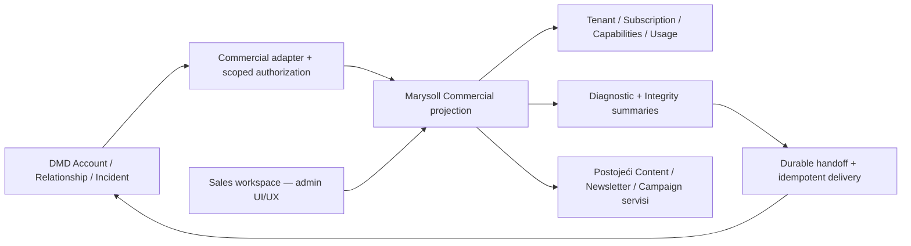

# PANTA — Marysoll Commercial / Client Success

> **Kontrolni dokument — TARGET ugovor, 2026-10-05.**
> Dokumentaciona osnova: `origin/main` na commitu `ebca79e`.
> Grana: `docs/commercial-client-success-contract`.
> Ovaj rez definiše površinu, authority, integraciju i redosled; Commercial
> API, Sales autentifikacija i dashboard još nisu implementirani.
> Status i redosled rada vode se samo u [TODO.md](TODO.md).

## 1. Product odluka i persona

Marysoll Commercial / Client Success je Sales representative radni prostor za
Marysoll proizvod: dodeljene naloge, komercijalno stanje, adopciju, marketinšku
asistenciju i support triage. Njegov UI/UX prati admin dashboard, sa svojim
tabovima, stranicama i serverskim ugovorima.

**DMD ostaje glavno radno mesto za odnos sa klijentom i operativni handoff.**
Marysoll je glavno mesto za rad nad činjenicama i dozvoljenim operacijama
Marysoll proizvoda. Ulaz iz DMD Account-a otvara odgovarajući Marysoll
Commercial account view; `Open in DMD` vraća u isti Account ili Incident.

| Površina | Odgovornost |
|---|---|
| DMD Commercial | Relationship, Sales, dodela representative-a, next action, zadaci, ownership support slučaja, Incident i technical handoff |
| Marysoll Commercial | Product truth, komercijalna projekcija, product operations, adopcija, sažeta dijagnostika, priprema kampanja |
| Tenant Admin | Vlasnikov salon i njegovi klijenti, termini, sadržaj, kampanje, loyalty i odobrene tenant operacije |
| Superadmin | Platform administration, tehničke operacije, cross-tenant diagnostics i privilegovane produkcijske radnje |

Commercial je platformska projekcija za treću personu. Ne uvodi novi Salon/Edu
business tenant, ne menja postojeći tenant boundary i ne pravi Sales-a
`OWNER`, `ADMIN`, `STAFF` ili superadminom. Dodela naloga nije članstvo u timu
salona i ne troši salonov staff seat.

## 2. Jedan autoritet po odluci



Commercial je composition surface i projection sloj, ne novi CRM, billing,
Newsletter, Diagnostic niti Marketing engine.

Pojam „Marketing Engine“ iz priloga mapira se na postojeću kanonsku podelu:
Content = sadržaj, Distribution = plasman/atribucija, Notification = transport,
Audience = publika, AI = asistencija. Distribution i novi Growth Studio su
**TARGET**, ne gotovi runtime paketi. Prva Sales projekcija koristi postojeće
Marysoll campaign/newsletter servise kroz njihove authority granice; ne čeka
izdvajanje svih budućih engine-a i ne kopira njihov domen u DMD.

Marysoll ostaje autoritet za tenant, trial/subscription, efektivni plan,
capabilities, product usage, campaign sadržaj/status i diagnostic evidence.
DMD je autoritet za Account, commercial assignment, relationship health,
Incident status i assigned technical owner. Cross-link i prikaz sažetka ne
prenose pravo na promenu izvornog zapisa.

## 3. CURRENT — potvrđena polazna osnova

| Postojeće | Izvor i granica za novi rad |
|---|---|
| Tenant i Subscription | [`Tenant.ts`](../src/models/Tenant.ts), [`Subscription.ts`](../src/models/Subscription.ts): odvojeni tenant status, trial polja, billing status, period i provider |
| Efektivni plan | [`planFeatures.ts`](../src/lib/plans/planFeatures.ts), [`effectivePlans.ts`](../src/lib/plans/effectivePlans.ts): status-aware resolver i Tenant fallback; Commercial mora deliti pravila |
| Read sa mogućim write efektom | [`subscriptionService.ts`](../src/lib/plans/subscriptionService.ts) ima `getOrCreateSubscription`; [`features/route.ts`](../src/app/api/subscriptions/features/route.ts) može kreirati legacy Subscription. Commercial GET ne sme koristiti taj efekat |
| Capabilities | [Tenant verticals & capabilities](PANTA-TENANT-VERTICALS-CAPABILITIES.md): platform availability, plan entitlement i tenant enablement; permission i ownership su zasebni uslovi |
| Browser dijagnostika | [`DiagReport.ts`](../src/models/DiagReport.ts): slobodna `label`, UA/IP/host/results i TTL 30 dana; nema authoritative `tenantId`/DMD Account veze |
| Javan report intake | [`public/diag-report/route.ts`](../src/app/api/public/diag-report/route.ts): postoji i bez login-a; label nije identity niti authorization |
| Integrity | [`diagnostic-client.ts`](../src/lib/platform/diagnostic-client.ts) i app kolektori: read-only provere; `failed` znači da provera nije izvršena |
| Newsletter i editor | [`AdminNewsletterDashboard.tsx`](../src/components/admin/AdminNewsletterDashboard.tsx), shared Content Composer, postojeći Marketing AI i campaign API; Sales pristup im još ne postoji |
| Gateway | [Proxy pipeline](PROXY-PIPELINE.md), [`system.ts`](../src/lib/proxy/pipeline/system.ts): `/api/internal/*` prolazi uz interni secret pre daljih guardova; to nije per-Sales account authorization |

U ovom repo-u nije pronađena implementirana Commercial/Sales projekcija ni DMD
adapter. DMD `SALES-0A`, njegova staff identity, assignment i Incident API
poznati su iz priloga kao plan druge platforme; njihove implementacije i
stanje nisu auditovani ovim dokumentom.

## 4. Account ↔ Tenant mapping i pristup

DMD Account nije Marysoll krajnji klijent salona (`TenantUser`), a
`salesRepresentativeId` nije salonov staff ID.

TARGET binding sadrži `bindingId`, `dmdAccountId`, `productKey: marysoll`,
`tenantId`, `environment`, status i revision. DMD poseduje Account i dodelu;
Marysoll proverava binding i svoj stvarni tenant. Jedan DMD Account može imati
više proizvoda i više eksplicitno povezanih Marysoll business tenant-a; svaki
prikaz/operacija bira konkretan binding. Za jedan tenant u jednom okruženju
postoji jedan aktivni Marysoll product binding; izuzetak zahteva zaseban ugovor.
Slug, ime, email i slobodna labela služe prikazu, nikad automatskom povezivanju.

DMD subject identitet se mapira na Commercial principal. Marysoll čuva samo
integracionu vezu/policy podatke neophodne za proveru; ne pravi paralelnu
assignment listu koju Sales uređuje lokalno.

```text
allow = verified principal
     && active DMD assignment za konkretan account/binding
     && binding pripada traženom Marysoll tenant-u i okruženju
     && Commercial action permission
     && relevantna tenant capability, za product operaciju
     && konkretan resource pripada tom tenant-u
```

Svaki list/detail/mutation server put primenjuje isti policy. DMD servisna
akreditacija dokazuje ko zove integraciju; uz nju mora postojati proverljiv
actor/assignment context. Sam interni secret, frontend tenant switcher, query
`tenantId`, DMD link ili sakriveno dugme nisu dokaz Sales pristupa.

Scope se ponovo proverava na svakom zahtevu i pre mutacije. Nepoznat,
istakao, opozvan ili neproverljiv assignment zatvara pristup. Cache ne sme
produžavati opozvano ovlašćenje; freshness/revocation ugovor mora biti zatvoren
pre live integracije. Query cache ključ uključuje principal, binding/tenant i
okruženje; promena account-a ne sme prikazati prethodne privatne podatke.

## 5. Sales dashboard — IA i UI/UX ugovor

Predlog route namespace-a je `/commercial`, sa posebnim Commercial shell-om.
Rute u tabeli su **TARGET**, još ne postoje. Produkcijski host bira se u
routing rezu; ovaj dokument ne provisionuje `sales.*` ili drugi domen.

| Tab / stranica | Predlog rute | Sadržaj / dozvoljeni tok |
|---|---|---|
| Overview | `/commercial` | Moji dodeljeni account-i, trial/subscription pažnja, usage/health sažetak i DMD next action |
| Accounts | `/commercial/accounts`, `/commercial/accounts/{bindingId}` | Lista dodeljenih i product dossier pojedinačnog account-a; `Open in DMD` |
| Trials & Subscriptions | `/commercial/subscriptions` | Trial rokovi, billing status i efektivni plan; u početku čitanje |
| Marketing | `/commercial/marketing` | Aktivnost, nacrti, planirane kampanje, performance i neiskorišćene dostupne mogućnosti |
| Newsletter | `/commercial/newsletter` | Drafts, Scheduled, Sent, Performance i Audience summary; kasnije scoped draft akcije |
| Diagnostics | `/commercial/diagnostics` | Sažeti browser reporti i integrity health; dijagnostički link i Incident handoff |
| Incidents | `/commercial/incidents` | DMD status projekcija, technical owner i link; lifecycle se vodi u DMD-u |
| Product Usage | `/commercial/usage` | Booking/staff/adoption i usage/resource agregati sa periodom i svežinom |

Sve account stranice imaju vidljiv izabrani tenant/account i okruženje.
Overview nije platform-wide superadmin statistika: računa samo assigned scope.
Nepovezan account, neuspešno merenje i nula aktivnosti imaju različita stanja.

Izgled koristi postojeći admin dashboard visual language: sidebar, header,
kartice, tabele, filtere, dark mode i responsive ponašanje. Deliti prezentacione
komponente gde su neutralne; ne importovati kompletan admin dashboard/sidebar
sa njegovim data hookovima i zatim skrivati privilegovane tabove.

Commercial navigacija i dostupne akcije dolaze iz server policy projekcije.
Read stranice su Server Components po defaultu; interaktivni leaf-ovi i hookovi
koriste postojeći React Query obrazac. UI ne uvozi Mongo modele ni engine
internals. Sadržajni editor ostaje isti Content Composer uz Commercial host
adapter i svoj endpoint/policy.

Product dossier prikazuje representative-a iz DMD-a; stvarni plan/status,
trial i period iz Marysoll-a; active staff count, booking usage i poslednju
merenu aktivnost; campaign sažetak; otvorene DMD incidente i DMD relationship
health. Primeri poput „Team €49“ iz priloga su ilustracija, ne novi pricing
model: današnji plan ključevi su `maria`, `claudia`, `kiki`, `enterprise`.

## 6. Authoritative trial/subscription projekcija

`MARYSOLL-SALES-1` je preduslov API-ja, jer UI ne sme sam da kombinuje
`Tenant.plan`, trial i Subscription u proizvoljno „Active“ stanje.

Projekcija odvojeno vraća:

- `tenantStatus` i `effectivePlan`, sa izvorom rezolucije;
- `subscriptionStatus`, billing provider i current period end;
- trial status/rok i razlog, iz zajedničkog trial resolvera;
- raspoložive capabilities i vremenski ograničene override-e;
- iznos, valutu i interval samo ako postoji pouzdan billing/catalog izvor,
  jasno označen kao stvarna pretplata ili kataloška cena;
- `asOf` i source/quality state za nepoznato, nedostajuće ili neusaglašeno stanje.

`currentPeriodEnd` nije dokaz „Paid through“. Trialing nije dokaz uplate.
Ne izvodi se iznos iz naziva plana niti iz slike cenovnika. Ako payment
potvrda ne postoji u authority sloju, prikazuje se „Period do…“ ili nepoznato
plaćeno-do, a ne izmišljena potvrda.

Legacy Tenant fallback mora pratiti postojeća efektivna plan pravila; stale
trial boolean ne sme nadjačati istekao rok. Svi granični datumi koriste jedan
server `now`; UI prikazuje datume u odgovarajućoj zoni. Nova read projekcija
ne kreira Subscription, ne produžava trial i ne menja provider stanje.
Sales u prvoj fazi ne može menjati plan, trial, status ni resource kvotu.

## 7. Backend ugovor i DMD adapter pre UI-ja

Predlog versioned transporta, konačan shape zaključava `MARYSOLL-SALES-0/2`:

| Ulaz | Odgovor / namena |
|---|---|
| `GET /api/internal/commercial/v1/accounts` | DMD adapter: paginirane assigned projekcije, bez platform-wide liste |
| `GET /api/internal/commercial/v1/accounts/{dmdAccountId}` | Account sa svojim dozvoljenim product binding-ima; detail bira konkretan binding |
| `GET /api/internal/commercial/v1/bindings/{bindingId}` | Tenant/subscription/trial/capabilities/usage/health projekcija |
| `GET /api/internal/support/v1/bindings/{bindingId}/diagnostics` | Sažeti reporti za dozvoljeni binding |
| `/api/commercial/v1/...` | Browser BFF nad istim projection/policy slojem; Commercial sesija, bez internog secreta u browseru |

Ni jedan od ovih endpoint-a još nije implementiran. Centralizovane Zod šeme
validiraju actor context, query/cursor, body i response; izvedeni tipovi žive u
postojećem `src/types/` obrascu. Namenske server policy/read mapper funkcije
pripremaju allowlist DTO, ne serijalizuju modele pa uklanjaju nekoliko polja.

Read DTO ima verziju, account/binding/tenant identifikatore, product summary,
akcije koje su stvarno dozvoljene i `asOf`/quality za svaki nezavisni izvor.
DMD relationship i Incident podatke drži u svom namespace-u; njihov outage ne
pretvara Marysoll product facts u nule. Neutvrđeno stanje je nullable ili
`unavailable`, a delimično zastareo snapshot je eksplicitno označen.

Nema eksplicitnog ili implicitnog GET side effect-a. Batch list projekcija
koristi shared resolvere i ograničene upite; ne zove deset admin API-ja iz
browsera. DMD dobija sažetke i deep-linkove, bez Marysoll editora i raw baze.

## 8. Diagnostics i Client Health

Sales dobija datum, area, status, razumljiv impact summary, grubo okruženje
(npr. mobile/Safari), report reference i preporučenu sledeću radnju.
Browser report i integrity report su različiti izvori; UI ih ne predstavlja
kao jedno sveže skeniranje ako su prikupljeni u različito vreme.

Client Health za Booking, Loyalty, Vouchers, SEO, Ownership i Push koristi
postojeće dostupne provere i agregate. Ne izmišlja novu proveru samo da popuni
karticu. Rezultat mora razlikovati `ok`, `attention`, `failed`, `not_run`,
`unavailable`/`expired`; `failed` nije zeleno stanje niti 0 findings.
Stari report ne dokazuje današnje stanje. Relationship health i komercijalni
rizik ostaju odvojeni od tehničkog integrity health-a.

Sales ne dobija raw stack trace, evidence dokumente, IP, auth/push tokene,
pune query stringove, privatne klijentske/education/care podatke niti repair
parametre. Summary mapper je allowlist; poruke greške sanitizuje pre prikaza i
pre slanja u DMD. Akcije su `Create Incident`, `Generate Diagnostic Link` i
technical handoff, uz njihov permission. Repair, Delete, Merge i Rebuild
ledger ostaju izvan Commercial policy-ja.

## 9. Diagnostic link i trusted support context

Sales izdaje link za konkretan assigned binding/support case. Primaoc otvara
postojeću dijagnostiku na problematičnom uređaju; login može biti upravo deo
problema, pa samo slanje reporta ne zahteva tenant-admin sesiju.

TARGET `supportToken` je kratkotrajan, potpisan ili opaque server-verifikovan,
sa ograničenom namenom i mogućnošću opoziva. Server vezuje token za
`tenantId`, `dmdAccountId`, representative/principal, support case ili incident
draft reference i okruženje. Rok, bounded submit/reuse politika i token store
zaključavaju se pre izdavanja prvog live linka.

Token daje samo pravo za taj ograničeni diagnostic intake. Ne daje pravo na
čitanje account-a, reporta, klijenata, sesije ili tenant-admin funkcije.
Server iz validnog konteksta određuje association; ne veruje `tenantId`,
account-u ili representative-u poslatom iz browser body-ja. `?u=` može ostati
compatibility label, ali nikada ne povezuje stare reportove automatski sa
Sales account-om. Nepovezani legacy reporti ostaju izvan Sales scope-a.

Token ne sadrži PII i ne ulazi u engine report, analytics, logove niti DMD
source URL. Po prijemu se uklanja iz vidljive adrese gde je moguće; reference
koje se dalje prenose koriste čistu, allowlisted adresu. Postojeći javni report
intake zadržava kompatibilnost, ali dobija Zod whitelist, payload cap i
bounded/rate-limited token intake u odgovarajućem rezu.

## 10. Diagnostics → DMD Incident

DMD Incident je operacionalni artifact nad postojećim product/account-om.
`SalesTicket` je pre-sale informacija od prospect-a i ostaje zaseban domen.
Marysoll ne pravi drugi kanonski Incident lifecycle.

Minimalni handoff sadrži product `marysoll`, account/binding/tenant reference,
source kind/reference, diagnostic report ID, sanitizovan summary, title,
impact, opcionu severity, verified reportedBy i reportedOnBehalfOf,
server timestamp, correlation/idempotency reference i čistu source adresu.
Sales može dopisati kontekst razgovora; to je eksplicitno uneti sadržaj sa
zasebnom validacijom, ne automatsko čitanje poruka ili formulara klijenta.

```text
Client → Sales → Marysoll Diagnostic report (durable)
                     ↓
             Handoff delivery record
                     ↓ retry istog zahteva
              DMD Incident → Technical Owner
                     ↓
      bug/problem → engineering task → commit → QA → release
      configuration/support resolution → verification
      nova potreba → feature/requirement candidate
```

Report se sačuva pre handoff-a i obaveštenja. DMD outage ostavlja report i
minimalan durable delivery zapis za retry, ne lažni „Incident created“.
Retry istog submission ID-ja ne kreira drugi Incident; DMD endpoint mora
podržati idempotency key i vratiti postojeći Incident ID. Novi namerni slučaj
zahteva novi submission ID. Marysoll delivery status nije DMD incident status.

Predloženi DMD status vocabulary iz priloga je:
`new → triaged → needs_information / accepted → investigating → fix_in_progress
→ verification → resolved → closed`. To je vocabulary za budući DMD ugovor,
ne tvrđenje da DMD API već postoji niti da su svi prelazi linearni. DMD
poseduje dozvoljene prelaze i technical assignment. Marysoll prikazuje vraćeno
stanje; ne označava Incident resolved samo zato što je jedan check postao zelen.

Raw `DiagReport` danas ima TTL 30 dana. DMD Incident može zadržati odobren
sanitizovan summary i referencu uz svoju retention politiku; posle TTL-a prikaz
jasno kaže da evidence više nije dostupan. Ne produžavati retention raw
reporta ili kopirati sve payload-e automatski.

[DIAG-SUPPORT-1](PANTA-EDU-CENTAR-ARC.md#posle-pilota--dva-dijagnostička-reza)
već zahteva durable prijavu pre best-effort obaveštenja. Commercial proširuje
isti tok trusted account kontekstom i DMD handoff-om. Pri implementaciji
usklađuju se postojeći lokalni support intake i DMD canonical Incident; ne
nastaju dve nezavisne prijave sa konkurentnim lifecycle-om. Automatsko
kreiranje Incident-a iz critical findings ostaje buduće, posle procene šuma.

## 11. Marketing / Newsletter Sales projection

Sales vidi assigned tenant campaign metadata, Drafts/Scheduled/Sent,
performance, upcoming aktivnosti i audience agregate. Marketing je pogled
na aktivnost/asistenciju, Newsletter na email tok; oba referišu isti izvorni
campaign ID i editor gde se njihove odgovornosti preklapaju.

U draft fazi dozvoljene su samo posebno gated akcije: pripremi/predloži,
kreiraj/izmeni Sales draft, dupliraj prethodnu kampanju u novi draft i zatraži
odobrenje. Ne uređuje se live ili već poslati sadržaj kroz draft put. Autorstvo
Sales-a i tenant owner ostaju sačuvani u auditu. Audience izbor koristi
odobrene tenant-scoped segmente, bez pune liste primalaca u Sales response-u.

| Akcija | Početni režim | Kasniji managed-service režim |
|---|---|---|
| Product/account/usage/health read | Assigned scope i read permission | Isti scope |
| Marketing/Newsletter draft write | Tek u SALES-5, uz action permission i tenant capability | Isti uslovi |
| Request tenant approval | Uz immutable revision/reference drafta | Isti uslovi |
| Send / schedule / publish / unpublish | Sales nema pravo; izvršava authorized tenant flow | Eksplicitna aktivna tenant delegacija za konkretnu akciju |
| Audience export/delete i pristup ličnim podacima primalaca | Nedozvoljeno | Nisu deo ovog ugovora |
| Trial/plan/kvota/status promene; integrity repair/merge/delete | Nedozvoljeno | Ostaju izvan Commercial scope-a |

Odobrenje je vezano za tačnu draft revision, content, audience/segment,
channel/action i, za schedule, odobreni termin. Promena bilo čega relevantnog
invalidira odobrenje. Sales ne odobrava sopstveni draft. Tenant approve šalje
ili objavljuje kroz postojeći domenski command uz ponovnu validaciju scope-a,
capability-ja i verzije; Sales ne dobija trajno send pravo od jednokratnog
odobrenja. Stvarna notification/approval UX implementacija pripada SALES-5.

Buduća delegacija, npr. `marketing.publish` ili `newsletter.send`, mora nositi
issuer/authorized tenant actor, tenant, delegate, precizan action/resource
scope, rok, opoziv i audit. Nazivi su **TARGET**, nisu postojeći capability
ključevi. Assignment, tenant feature entitlement i delegation su različite
odluke. Zakazivanje je send autoritet: backend scheduler ne sme izvršiti
neodobren Sales draft niti zaobići opoziv delegacije po definisanom ugovoru.
Managed-service write se ne otvara u read-only foundation-u.

## 12. Proxy, autentifikacija i cross-linkovi

Commercial page/API namespace mora biti eksplicitno zaštićen pre dodavanja
UI-ja. Novi `commercial` segment ulazi u centralni reserved system vocabulary
pre path-based tenant detekcije. Postojeći admin/superadmin role guardovi se
ne proširuju tako da Sales nasledi njihove privilegije.

Gateway ostaje orchestration preko platformskih klijenata. Commercial
identity/assignment policy živi u svom server adapteru i route/service sloju;
proxy ne uvozi campaign modele niti odlučuje billing pravila. Interni early
pass zahteva novu route-level account/actor proveru i kada je secret validan.
Browser nikada ne dobija `INTERNAL_API_SECRET` niti DMD servisnu akreditaciju.

DMD → Marysoll link sadrži binding/resource adresu, ne bearer sesiju ili
privilegovani `supportToken`. Prijava/SSO exchange je zaseban ugovor sa DMD
`SALES-0A`: verified issuer/audience, kratko trajanje, replay/state zaštita,
proverljiv principal i aktuelna assignment. Link sam ne loguje korisnika.
Marysoll → DMD URL gradi server iz allowlisted environment config-a; arbitrary
return URL iz browsera ne postaje redirect. Svaka aplikacija proverava svoj
pristup i na direktno otvorenom deep-linku.

Produkcija je host-based; staging/QA/localhost/preview su path-based po
postojećem host-context ugovoru. Cross-linkovi i callback-i ostaju u svom
okruženju. Routing matrica mora pokriti oba smera, tenant wildcard/custom
domene, reserved segment, direktan API, expired session i cross-tenant pokušaj.

## 13. Rezovi i redosled implementacije

Dosledan prefiks je **MARYSOLL-SALES** (normalizacija `MARYSOL-SALES` iz priloga).
Ova tabela definiše acceptance ugovore, ne označava implementaciju završenom.

| Rez | Isporuka i acceptance gate | Zavisnost |
|---|---|---|
| SALES-0 — Commercial Projection Contract | Ovaj kontrolni dokument; dogovor DMD actor/assignment/binding i versioned DTO, permission matrica, scope/no-write/privacy pravila | Dokument je napisan; cross-platform auth/API detalji čekaju DMD potvrdu |
| SALES-1 — Trial/subscription authority | Shared read-only resolver; legacy fallback, rokovi, missing Subscription, source/unknown, stvarna cena bez pretpostavki; dokaz GET nema write | SALES-0; ne zahteva DMD staff auth za unit/integration testove |
| SALES-2 — Commercial read-only API | Projection/policy/read mapper + DMD adapter contract; assigned list/detail, pagination, stale state, svaki tenant isolation test | SALES-1; live endpoint tek uz verified DMD identity/assignment |
| SALES-3 — Diagnostic/support projection | Sanitizovani browser/integrity DTO; report↔tenant binding; restricted support token intake, revocation/expiry i legacy compatibility | SALES-2 policy; koristi postojeći Diagnostic sloj |
| SALES-4 — DMD Incident handoff | Durable report/delivery, idempotent adapter i Incident reference/status projection; timeout/retry/duplicate test | SALES-3 + DMD Incident contract/API |
| SALES-5 — Marketing/Newsletter projection | Read summaries + scoped draft/duplicate/request approval; revision-bound tenant approval; postojeći editor/commands, bez Sales send defaulta | SALES-2; tenant approval i audit pre prvog write-a |
| SALES-6 — Commercial dashboard | Admin visual shell, osam tabova/stranica, assigned tenant context, oba cross-linka, UI states i responsive acceptance | SALES-2 + dokazan DMD adapter; Diagnostics/Incidents/write moduli tek kad SALES-3/4/5 gate-ovi prođu |

Prvo backend contract i DMD adapter, potom UI. Read UI iz SALES-6 može pokazati
samo završene module; ostali se jasno označavaju unavailable/planned i nemaju
aktivne write akcije. DMD `SALES-0A` i Marysoll resolver/DTO/sanitization rad mogu
napredovati paralelno uz test principale i adapter fixtures, bez puštanja
neautorizovanog produkcijskog endpoint-a i bez privremenog superadmin login-a.

Postojeći STAFF-3 acceptance, Education pilot i odloženi T3/Distribution dugovi
ostaju u tracker-u. Ovaj dokument otvara Commercial luk; nije nalog da se
implementiraju svi rezovi ili da se usput preprave ostali domeni.

## 14. Release i verifikacioni gate

Task grane uvek kreću od svežeg **`origin/main`**. Engine/projection kandidati
idu kroz `staging/production-engines`; proxy/auth regression kroz
`staging/production-fixes` prema [branching strategiji](PANTA-BRANCHING-STRATEGY.md).
Shared-DB pravila ostaju: additive/optional promene, legacy runtime default,
bez globalnog backfill-a; tenant-scoped dry-run pre eksplicitnog apply-a.
Staging domen nije dokaz izolovane baze; aktivni DB target proverava se pre
write QA, migracija ili slanja. DMD i Marysoll test identiteti ne smeju prelaziti
iz staging-a u produkciju preko cross-linka ili integracije.

Implementacioni release mora dokazati:

1. Nema tokena, assignment-a ili dozvole: direktan page/API pristup odbijen;
   assigned A ne može listati, otvoriti, draftovati ili dijagnostikovati B.
2. Opozvan assignment/delegation i pogrešno okruženje zatvaraju pristup; DMD
   outage i stale policy ne proširuju scope.
3. Commercial GET ne menja Tenant, Subscription, campaigns niti integrity
   podatke; source/failed/unknown se ne pretvaraju u zdravo ili nulu.
4. Token tamper/expiry/replay ne povezuje report sa tuđim tenantom; nijedna
   Sales projekcija, SSR/RSC payload ili handoff ne izlaže privatni evidence.
5. Report ostaje posle neuspelog DMD slanja; retry daje jedan Incident ID.
6. Sales draft ne može send/schedule/publish kroz direktan API, scheduler ili
   izmenu live sadržaja; tenant approval revizija se proverava server-side.
7. Proxy matrica, source typecheck, propisani code-quality/build i app/engine
   testovi prolaze; live QA na stabilnom domenu i browser acceptance sa Sales,
   tenant owner i technical owner principalima prethode produkciji.

Rizični multi-model workflow, npr. buduće binding reassignment ili delegacija
sa više domain write efekata, dobija matching read-only integrity proveru u
istom PR-u, prema Architectural Rules. Ovaj doc-only rez ne izvršava migracije,
DMD zahteve, deploy niti izmene runtime-a.

## 15. Otvorene odluke pre live povezivanja

| Odluka | Vlasnik / granica |
|---|---|
| DMD principal/SSO/service credential, assignment revocation i mapping API | Zajednički DMD SALES-0A + Marysoll SALES-0/2; u ovom repo-u nije potvrđeno |
| Konačni production host i auth/session cookie scope za Commercial | Marysoll proxy/identity rez; staging ostaje path-based |
| Binding lifecycle, ko odobrava povezivanje/prekid i audit reassignment-a | DMD Account authority + Marysoll tenant authority; Sales nema self-assign |
| Trial/billing disagreement precedence i pouzdan price/paid-through izvor | SALES-1; ne menja billing provider politiku bez posebne odluke |
| Support token rok/bounded reuse, sanitized summary retention i evidence expiry UX | SALES-3/4 + DMD Incident policy |
| Koji assigned draft-ovi se mogu uređivati i ko u tenant-u odobrava | SALES-5; početno authorized tenant owner, proširenje kroz canonical permission policy |
| Kasnija managed-service delegacija i efekat opoziva na odobrene schedule-e | Poseban write/delegation rez posle read/draft acceptance-a |

## 16. Kanonske reference

- [Architectural Rules](ARCHITECTURAL_RULES.md)
- [Product Engines](ARHITEKTURA-ENGINES.md)
- [Branching i QA](PANTA-BRANCHING-STRATEGY.md)
- [Proxy pipeline](PROXY-PIPELINE.md)
- [Tenant verticals i capabilities](PANTA-TENANT-VERTICALS-CAPABILITIES.md)
- [Ownership i Team lifecycle](PANTA-TENANT-OWNERSHIP-LIFECYCLE.md)
- [Diagnostic / Integrity](PANTA-IDENTITY-LOYALTY-HEALTH.md)
- [Newsletter / Blog authoring](PANTA-NEWSLETTER-BLOG-AUTHORING.md)
- [Content Composer](PANTA-CONTENT-COMPOSER-UX.md)
- [Distribution Engine](PANTA-DISTRIBUTION-ENGINE.md)
- [Growth Studio](PANTA-GROWTH-STUDIO.md)
- [Payments granica](PANTA-PAYMENTS-ENGINE.md)
- [Superadmin statistika / usage](SUPERADMIN-STATISTIKA-I-RESOURCE-QUOTA.md)
- [Operativni tracker](TODO.md)
